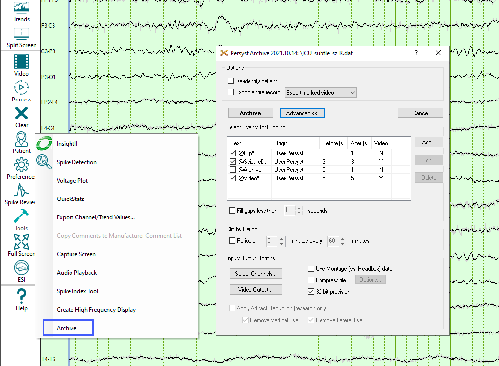

# Archiving selected EEG segments

# **Archiving selected EEG segments**

To access the Archive dialog, select **Tools**, then **Archive**
from the System Button Bar.

**Begin Archiving**

Select
the **Archive** button to begin archiving.
To
archive by multiple event types, multiple-select the list entries
by
clicking
on the events listed.

**Save
the Archive file**

The
**Choose the Output File** dialog
will open and you will be required to enter a file name. Use the default
name, or, if you wish, enter a different one. Click **Save**
to
create the archive file.