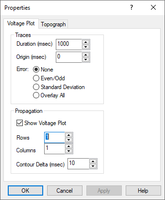

# Display Voltage and Propagation Plots

# **Display Voltage and Propagation Plots**

The **Voltage Plot**
program provides options for rendering and exporting waveform averages,
display of
topographic voltage maps
for single or multiple spike detections or hand-marked events
, propagation maps, and animations.

The waveform averages and maps
generated in Voltage Plot
are based on “@V
P
lot” comments created in Persyst. These can be hand-marked using the Persyst **Insert Co****mment**
tool
, or more commonly, using the automatic spike detection groups created in Spike Review.

Once spike groups are created in Spike Review, they can be exported as “@V
P
lot g=(x)” comments. The “g” number indicates the group.

Voltage Plot is launched from the
Persyst 15 **Tools**
menu. The procedure that follows will guide you through the pr
ocess of generating @VP
lot comments from Spike Review and then displaying them in the Voltage Plot program.

After creating spike groups as described in the 
Spike Review
guide, select **Final Report**
to display the groups
.
Select **Tools|****Mark Groups as VP****lot Comments**
. In the example below,
3 groups have been marked as VP
lot comments.

Close the Spike Review window
.
To display the Vplot comments, sort the
Persyst Comment List by Text and the @VPlot g=(x) comments will be displayed in group order.
S
elect **Tools|Voltage Plot**
.

**Select Group**
from the **Edit**
menu and select **OK**
to select Group 1. N
ow the traces and voltage plot reflect the average of the selected events.

Any montage created in Persyst can be used in Voltage Plot. Voltage maps are typically displa
yed using one of several
average reference
montage
s. In this example we have
select
ed
the **Referential (Av12) Longitudinal**
montage.

Select **Properties**
from the **Format**
menu to change the attributes of the display.
Note: You can also right-click on the map to display the Properties dialog.

Select the **Topograph**
tab to control what display elements are shown, and how the voltage contour is calculated (Interpolation) and drawn. **Nearest Pts**
is the number of nearest electrodes used to calculate points on the rectangular grid.
If using a user-defined Electrode Map of a square electrode array, the **Grid Pts**
is set for
the number of points on one sid
e of the rectangular grid.
Here we have changed the **Zones**
option from **Cells**
to **Contours**
to smooth the map rendering, and selected the **Electrode**
option to display the electrode locations on the map.

The Voltage
Plot tab offers control over the **Duration**
of the traces (1000 msec default). The **Origin**
offset time that allows you to shift the time used to create the voltage plots. (The origin is indicated by the light gray line near the middle of the traces.) The reliability of the traces used to create the average can be illustrated by displaying **Even/Odd,****Standard Deviation, or Overlay All**
traces.

The spatial propagation of the averaged event may be displayed by showing multiple voltage plots, **Rows**
and **Columns**
, at different times as determined by **Contour Delta**
.

From the **Voltage Plot**
tab, change **Propagation|Rows**
and **Propagation|Columns**
both to **3**
to see the propagation of the averaged spike over time. From the **Topograph tab**
, change **Zones|Cells**
to **Zones|Contours**
. Select **OK.**

