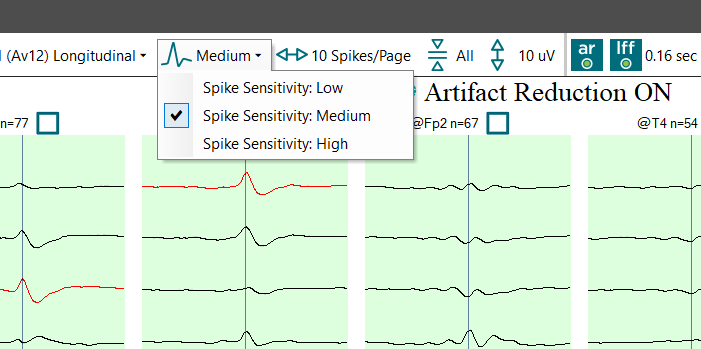

# Dynamic detection sensitivity adjustment

# **Dynamic detection sensitivity adjustment**

The sensitivity of the Spike Detector output can be dynamically adjusted during the review process. This is done by using the detection sensitivity selector shown in the image below. When Spike Review is initially opened, the detection sensitivity slider is set to Medium (default). In this position the Spike Detector neural network algorithms identify sharp transients that have a high probability of being epileptiform abnormalities: these are events the detector assigned a medium perception value. . However, some spikes and sharp waves that are less well-formed may not be evident with the selector set at medium sensitivity. The detector's sensitivity can be quickly adjusted by selecting High sensitivity so that it is more sensitive and thus more likely to identify less well-formed or lower amplitude transients. New groups may then appear in the Overview display of spike averages. In concert with the increase in true spike detections, there is also an increase in false positive detections.

In records with rare epileptiform abnormalities or those in which the Spike Detector neural networks, when set to lowest sensitivity, do not recognize the epileptiform abnormalities well, switching to the high setting on the detection sensitivity selector may allow visualization of real epileptiform abnormalities. In such cases, identifying the rare events often requires assessment of the individual raw detections. This is accomplished by either displaying all raw detections back-to-back following the spike averages on the overview page, or by reviewing the detections at each electrode location by progressively selecting the location tabs at the top of the EEG window (see the help topic Viewing back-to-back detections sorted by detection location).

In records with rare epileptiform abnormalities or those in which the SpikeDetector neural networks, when set to lowest sensitivity, do not recognize the epileptiform abnormalities well, switching to the highest setting on the detection sensitivity slider may allow visualization of real epileptiform abnormalities. In such cases, identifying the rare events often requires assessment of the individual raw detections. This is accomplished by either displaying all raw detections back-to-back following the spike averages on the overview page, or by reviewing the detections at each electrode location by progressively selecting the location tabs at the top of the EEG window (
see the help topic 
Viewing back-to-back detections sorted by detection location
).