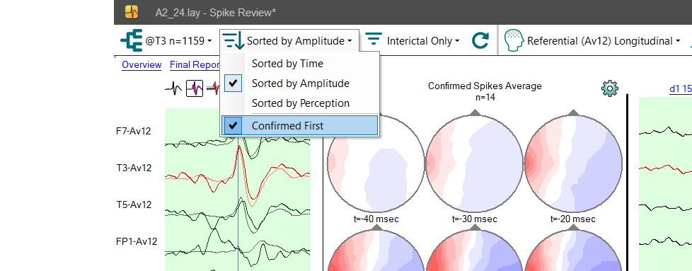
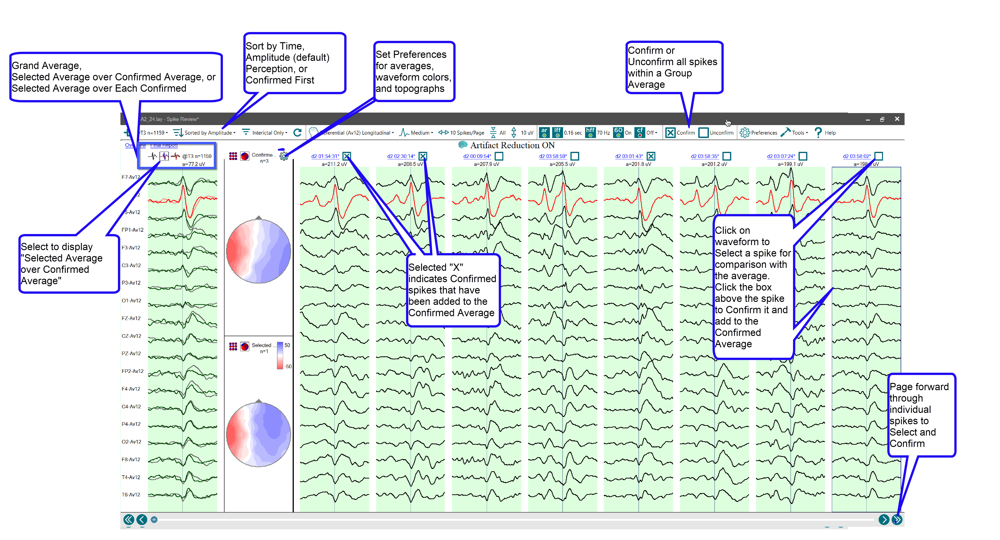
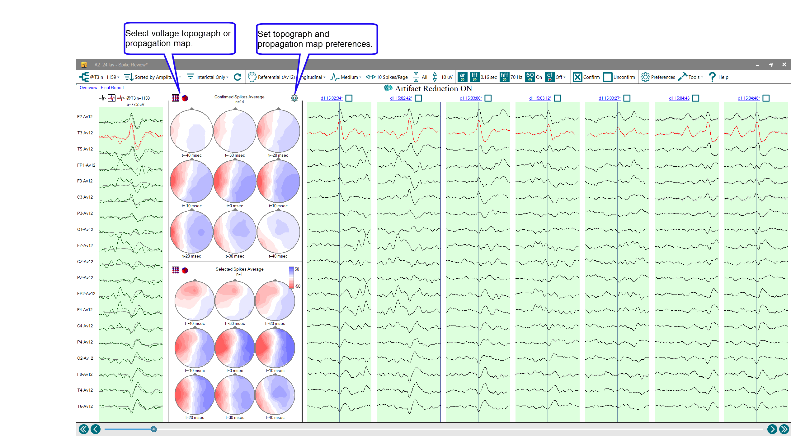

# Hand marking individual exemplar events for inclusion in FinalReport

# **Hand marking individual exemplar events for inclusion in FinalReport**

When viewing individual spike detections (accessed by double-clicking on any of the waveform averages in the EEG window), exemplar spikes can be hand-marked by left-clicking with the mouse on the desired example. Select the sorting option from the toolbar to switch from Sorted by Time to Sorted by Amplitude, and select the option for Confirmed First. (Sorting by Amplitude will display the highest-amplitude detections first, which are often the exemplars, too.) A rectangle outlining the chosen spike will appear. This will “Select” a spike detection. Select the button above the leftmost waveform display for Selected Average over Confirmed Average as shown below. 

As each spike is Selected, it will be displayed as an individual waveform over the average of spike(s) that have been Confirmed. This will allow evaluation of each Selected spike to see if it matches closely with the Confirmed average. For example, when performing source localization, this allows for visual evaluation of the first half-wave (rising segment) of the spike so that the average that is created from the Confirmed spikes is homogeneous.

In addition, propogation maps can be displayed for the Selected and Confirmed displays to visually asses if, at each time slice, the amplitude is in one location, or if the amplitude at each time slice is propagating. This allows for a visual evaluation of morphology and differences in propagation between the Selected (boxed) spike and the Confirmed spikes (indicated by the X selected above the spike waveform).

Hand-marked detections that are marked as Confirmed by selecting the box above the selected waveform  will be included in the spike averages that appear in the 
FinalReport
. These hand-marked events can also be displayed back-to-back, immediately following their averages in Final Report, and can be printed for archival purposes or for evaluation by another reviewer.

