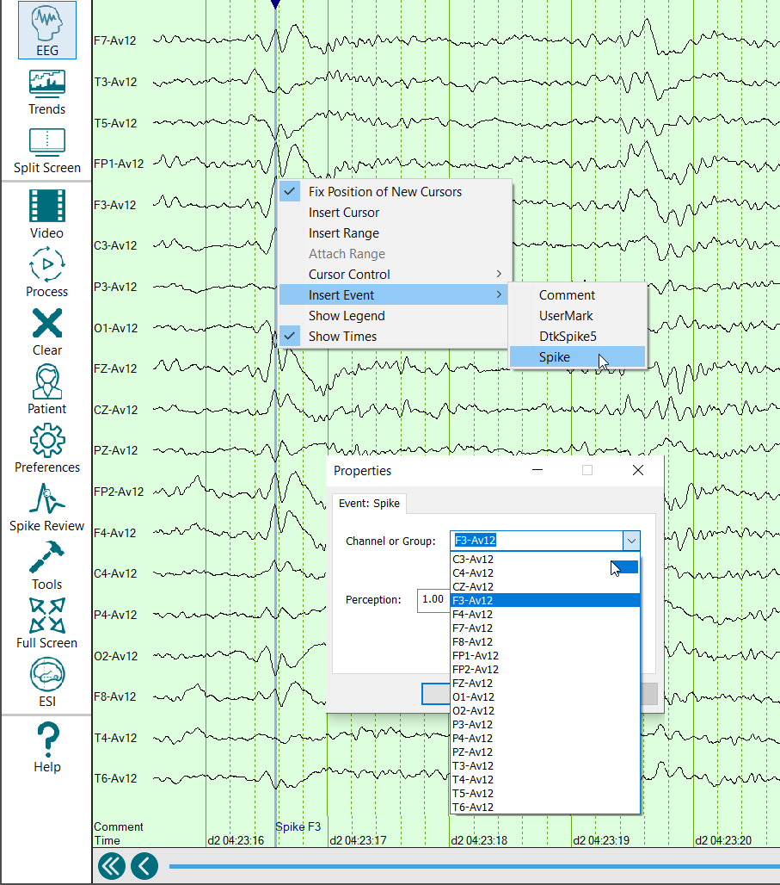

# Hand marking spikes from the EEG page for inclusion in Final Report

# Hand marking spikes from the EEG page for inclusion in Final Report

In cases where you wish to manually enter a spike event in the EEG record (e.g., if a recording has not been processed or if a spike has not been marked by the detector), there is a provision for hand-marking spike events and making those manually-marked spikes available in Spike Review.

To manually enter a spike event:  
  
1) Left-click on the EEG display to place the cursor at the time point that marks the peak of the event.  
  
2) Right click on the EEG display and then select Insert Event|Spike.

3) From the Properties window select the Channel or Group to indicate the electrode focus for the event.

The manually entered spike event will now appear as a spike comment in the Persyst EEG display and in Spike Review.

