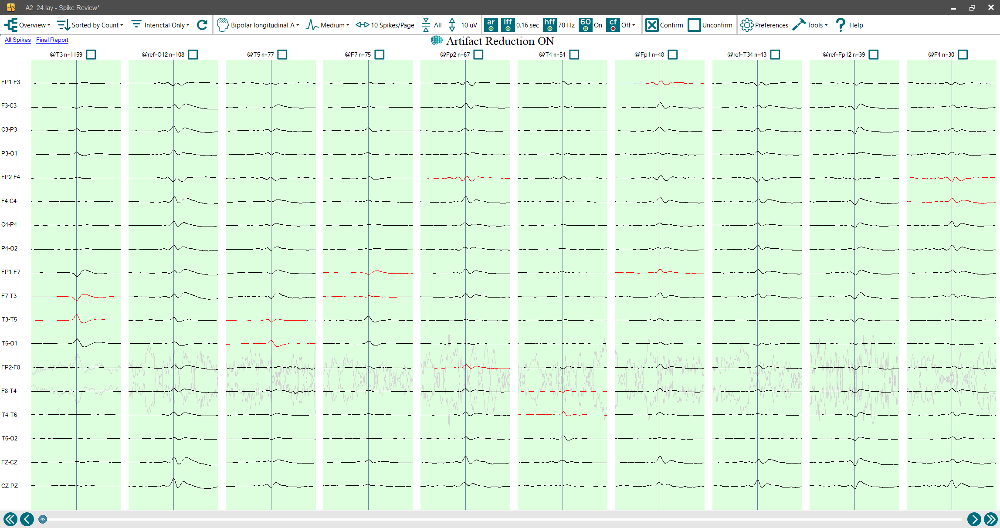
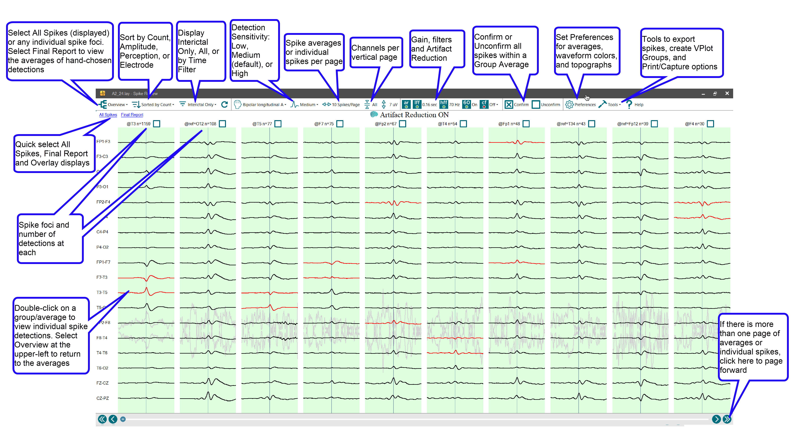
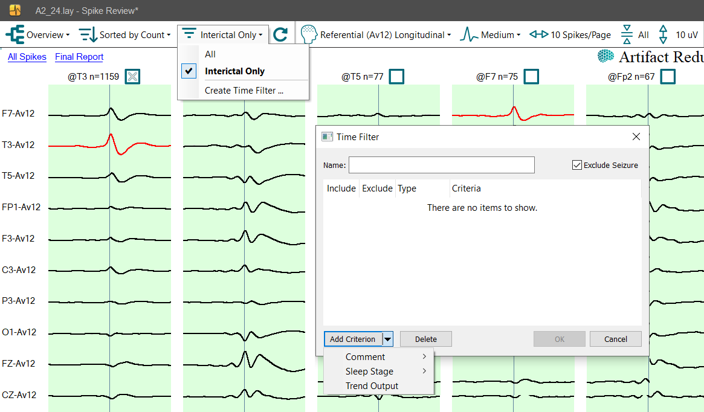

# Spike Review

# **Spike Review**

**Introduction**

After processing an EEG recording with
Persyst 15 , the spike detections are available for more detailed review with the Spike Review program.

Launch Spike Review from the System Button Bar
.

After a few seconds the Spike Review program will open. The Overview window is initially presented, as shown in
the image below. Overview depicts averages from the various spike foci detected by Persyst's Spike Detector. To create these overview averages the spike detections are sorted by detection foci (electrode) and then all detections at a particular focus are mathematically averaged. In the example below, the first column of EEG represents an average of 1159 events that had their maximum point of detection at the T3 electrode. Notice that columns of EEG are separated from other columns by a thin band. Each EEG column represents a distinct group average. The primary electrode focal point of each average, and the number of detection events incorporated into each average, are shown above the columns of EEG. 

Generalized spike averages have the prefix “ref=” e.g., “ref=O12n=108”. 
Channels including the detection focal point electrode are highlighted red. As with evoked potentials, averaging multiple detections results in an increase in the signal-to-noise ratio and makes it easier to delineate the field of distribution of epileptiform abnormalities.

The various functions of the Spike Review window are explained in the image below. Note that explanatory text associated with a computer mouse icon indicates a special access function accessible by mouse clicks.

*The Overview display shows averages of all detections at the selected sensitivity arranged by electrode focus. The primary electrode detection is in red. In this example, averages of well-defined spike foci are evident in the mid left-temporal region, mid left-posterior temporal region, left anterior temporal region, and right fronto-temporal region. Detections are most common in the left temporal region. A rarer left frontal focus is also evident.*

All spikes detected can be displayed, or they can be restricted to interictal detections only within the group averages and individual spike pages. Detections can be filtered further by time by selecting Create Time Filter. Time ranges can be defined by Comment Ranges, Sleep Stage (Persyst Research only), or a Threshold/Conditional Trend output.

