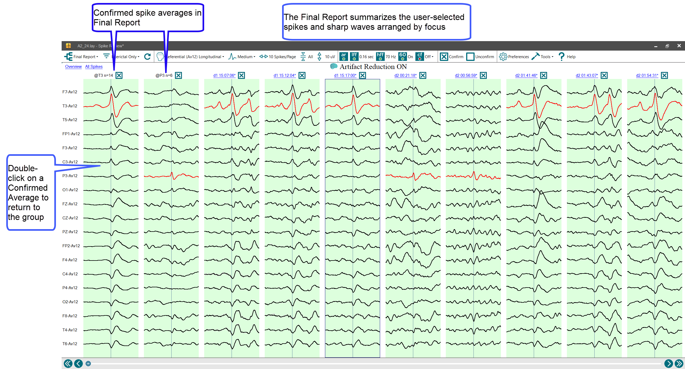
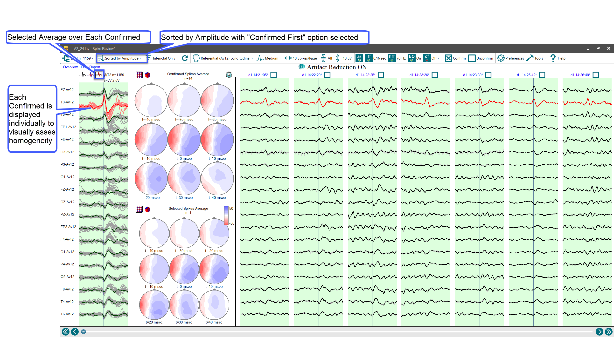

# Using FinalReport

# **Using FinalReport**

Clicking on FinalReport at the top
left
of the EEG window displays a summary of a
ll hand-marked events
. The initial default view shows the mathematical averages of the user-chosen hand-marked events, sorted by electrode focus.
As explained in the images below
, head voltage topograms and back-to-back individual user-selected events can be displayed by double-clicking on the waveform average to return to the individual detections for that group. Select the Final Report link in the upper-left corner of the display to return to the Final Report.  

