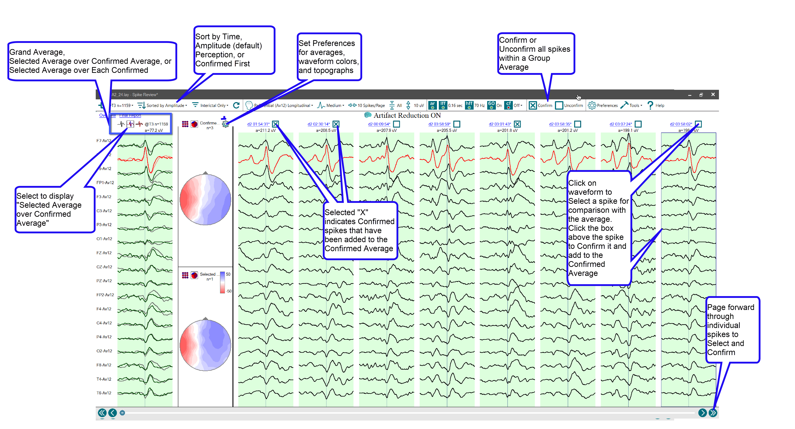
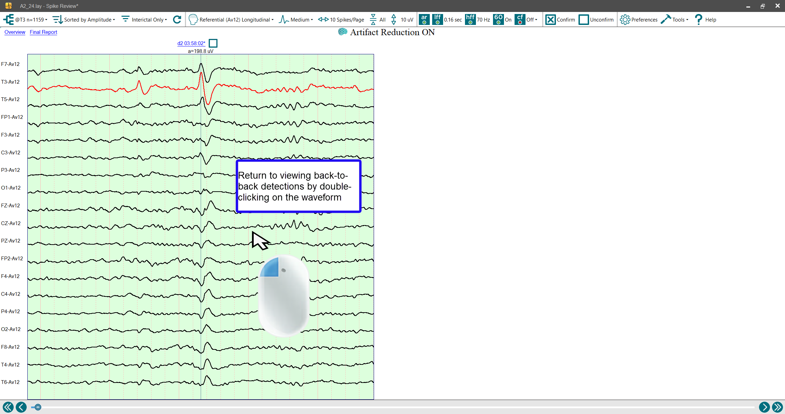

# Viewing back-to-back detections, sorted by detection location

# **Viewing back-to-back detections, sorted by detection location**

Double-clicking on any of the waveform averages in the EEG window will display the raw (non-averaged) spike detections that arose from that particular electrode location. The individual detections are separated by a thin band of white, and the detection point is centered in a one second segment of EEG and indicated by a faint vertical gray line. Left double-clicking with the mouse on any individual detection will cause an expanded EEG view of that
particular detection to appear
. Left double-clicking on the expanded view will return the user to a display of back-to-back individual detections.

