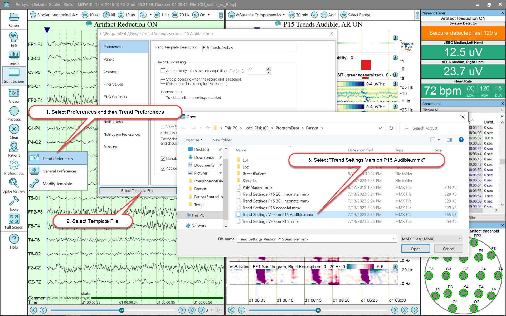

# Displays: Numeric, Electrode Signal Quality, Comment

# **Displays: Numeric, Electrode** **Signal Quality****, Comment**

Numeric Values

The Numeric V a lues window displays a list of values for selected trends . The value displayed is equal to the value of the trend at the point indicated by trend cursor . The list of trends displayed in the Numeric View and their how they are displayed can be modified in Preferences/Trending Preferences.

Comments

The Comment List displays the comments in the EEG record. Comments can be sorted in ascending or descending order by clicking on the title of each of the fields. At the bottom of the Comment list a series of tabs selects all or a subset of the Comments according to the description on the tab.

Electrode Signal Quality

The Electrode Signal Quality display window depicts whether electrode artifact detections at individual electrodes, as calculated by Persyst’s Artifact Reduction algorithms, have, for a specified user-adjustable time window, occurred more frequently than a user-specified threshold percentage. If the artifact detection percentage threshold is exceeded for the specified time window, then a red circle appears around the electrode on a head topogram display; otherwise, the circle around the electrode remains green. The electrode artifact values utilized for calculations in this display are outputs of intermediate steps in the Persyst Artifact Reduction algorithm. The displayed results can be used in conjunction with review of the original EEG waveforms to help determine when the application of one or more electrodes should be inspected.

An electrode will be flagged as poor quality if, during the specified time window ﴾Duration setting﴿, the artifact detection system marks artifact for greater than the specified percentage (Percentage setting) of that time window. For example, using a Duration setting of 300 seconds and Percentage setting of 5 0%,  artifact must occupy >50 % of the last 300 seconds ﴾i.e., > 150 of the last 300 seconds﴿ for an electrode to be flagged. The user-adjustable Duration and Percentage settings allow the user to customize the sensitivity of this display.

User-adjustable parameters:

1. Artifact assessment Duration window (seconds)
2. Percentage of artifact assessment duration window required to register as artifact before electrode is flagged
3. For Electrode Signal Quality graph: “Animate circle around the bad electrodes” (on/off), Show electrode names” (on/off), Show Quality values ( on/off), Electrode color scheme.
4. Parameter settings utilized in default trend examples ( Trend Settings Version P15 .mmx ) shipped with software: Animate circle around the bad electrodes: On, Show electrode names: Off, Show Quality values: Off, Electrode color scheme: BrainNet™, Duration: 300 seconds, and Percentage: 50%

Click HERE for information on the performance characteristics of Persyst Electrode Artifact Detection.

Display of Seizure Detections

The Numeric Values window indicates when there has been a seizure detection within the last 120 seconds. The Numeric Values window can be toggled from the tab position (not displayed) to be displayed. To show this window, select the Numeric Values tab in the upper-right corner of the Persyst 15 display.

 

**Example:** **Displaying the Numeric Values Window**

To dock the Numeric Values window so that it is displayed, hover the mouse pointer over the Numeric Values tab and then select the pin button when it opens.

 

**Optional Audible Notification of Seizure Detections**

Persyst 14 can be configured to play an audible notification to accompany the visual notification on the Numeric Display. Use the “Trend Settings Version P15 Audible.mmx” as shown in the steps below to enable Audible Notifications.

**Important:**
Your EEG System may automatically select the Trend Preferences File (.mmx) as part of the EEG System configuration. Also, your EEG System may provide separate audible notifications within that EEG System software for Persyst seizure notifications. Please contact Persyst if there are any questions regarding the modification of P15 settings for any integrated implementation of P15.

**Warning:**
Audible Notifications are dependent upon the computer system’s audio settings and volume level. Persyst 15 notifications cannot be used as a substitute for real time monitoring of the underlying EEG by a trained expert. Refer to the full Indications for Use and Warnings on the initial pages of this help file.

