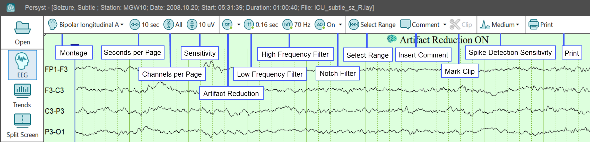
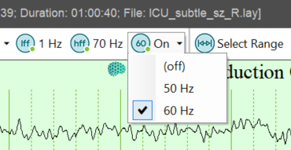
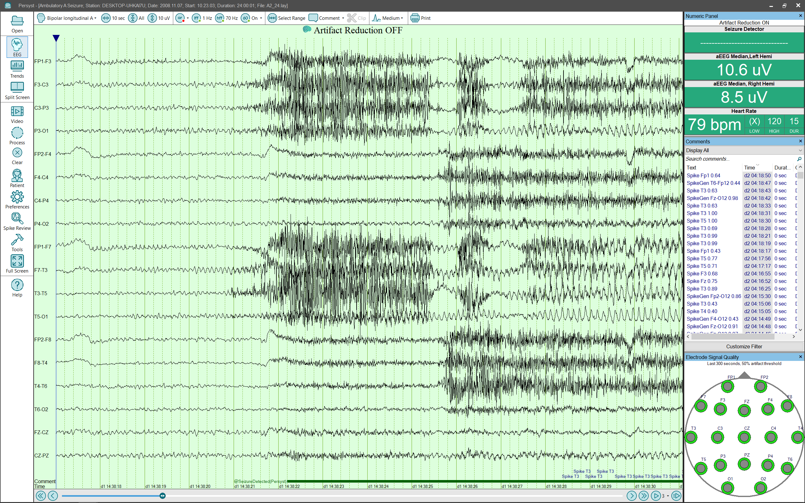
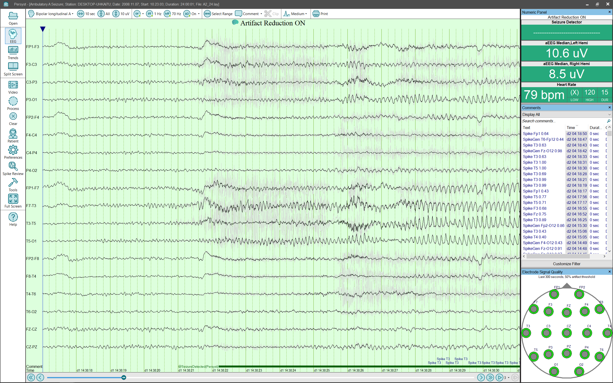

# EEG View

# EEG View

The EEG view displays the waveforms in the currently opened EEG recording. This view is controlled by choices made in the Preferences| General Preferences Dialog , as well as the EEG Button Bar at the top of the view. A set of channels, based on the currently selected montage, is displayed vertically. Time is displayed horizontally. Within each channel the waveform is displayed representing the voltage for a given channel at a given point in time.

A Scroll Bar at the bottom of the view moves the display forward and backward through the record. To the right of the scroll bar the “pin” button causes the display to automatically scroll as new data arrives. Pressing the “pin” button a second time stops the automatic scrolling. The “play” button automatically scrolls through the record at a pre-defined speed. Pressing the “play” button a second time pauses the display.

Clicking on the EEG display moves a cursor to that point in time. The cursor is moved to the beginning of the display when the scroll bar is used, or the record is first opened. The Trend View and the EEG View are synchronized so that when a point in time in one is selected it is also selected in the other.

The EEG Button Bar is used to make specific selections for the EEG View:

Montage: Selects the desired Montage (channel set) to be d isplayed. To keep the list compact only those Montages designated as “favorites” are displayed. There is a selection on the drop down called “Montage Groups…” that allows the user to select and de-select which Montages will be displayed. Montages can be added, deleted, and modified —see the help topic Edit or Create a New Montage for details .

Seconds Per Page: Selects the number of seconds of EEG that will be displayed within the EEG page size selected in General Settings .

Channels Per Page: Limits the number of channels per page. When the number of channels in a display montage is greater than the Limit n channels per page setting then a vertical scroll bar is displayed to page up/down.

Sensitivity: Selects the vertical scale for the display of voltage with in each channel.

Low Frequency Filter: Selects the value of the Low Frequency Filter that is applied to the EEG before it is displayed.

High Frequency Filter: Selects the value of the High Frequency Filter that is applied to the EEG before it is displayed.

Notch Filter: Selects whether the Notch Filter is turned on. The val ue of the Notch Filter is set from the Command Menu directly to the right of the Notch Filter button.

Comment: Opens a dialog, which specifies a comment to be placed in the current cursor location in the EEG.

Select Range: Marks a Range on the EEG waveform page. Click and drag the cursors to adjust the start and the end of the Range.

Clip: Opens a dialog, which inserts an “@Clip” comment for the duration of the selected Range. These comments are used to mark EEG for export with the Persyst Archive Tool.

Spike Detection Sensitivity: Set the spike detection sensitivity to Low, Medium (default), or High.

Print: Opens the Print dialog.

Artifact Reduction: Selects whether Artifact Reduction is turned on. Artifact Reduction removes a portion of the non-cerebral signals fr om the EEG prior to display. When Artifact Reduction is turned on the original EEG waveforms is displayed simultaneously with the Artifact Reduced EEG waveforms. A drop down selects which artifacts the system should reduce. When Artifact Reduction is selected an indication “Artifact Reduction ON” is prominently displayed at the top of the EEG waveform page . Click HERE for information on the performance characteristics of Persyst Artifact Reduction.

*Artifact Reduction OFF*

  
*Artifact Reduction ON*

Click 
HERE
for
information on the performance characteristics of Persyst Artifact Reduction
.