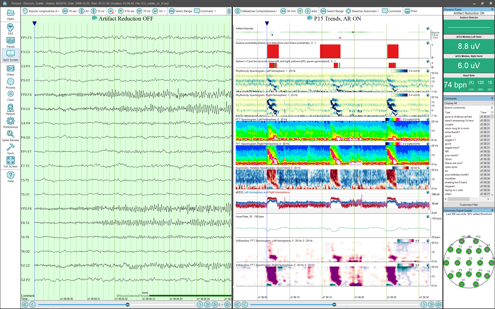

# Persyst 15 Overview

# **Persyst 15****Overview**

The screen capture below shows a scalp  recording open in Persyst. In this example the user has chosen to display EEG and trends in a split screen format.

The Window Title displays information about the record including the pati ent, the date and the duration. Information displayed here can be modified in settings.

The System Button Bar on the left allows the user to make global selections. For example , the user can open a record, choose what to display, and begin processing (spike detection, seizure detection and trending).

The main area is split between a n EEG view and a trending view. At the top of each view a button bar allows the user to make selections that apply to that particular area. For example , on the EEG view they can select t he desired Montage or Filters. On the trending view they can select a trending panel, and duration displayed on a si ngle page. (For a comprehensive list of the available functions please refer to the sections on EEG Review and Trending views.)

The Numeric Display shows the values of trend calculations at the currently selected point in time.

The Comment List shows the comments present in the record. Persyst automatically adds comments to t he record based on detections. The dropdown on top of the comments list allow the user to choose a subset of comments to display. Click HERE for information on the performance characteristics of Persyst Electrode Artifact Detection.

The Electrode Signal Quality display shows a Persyst calculated estimate of whether the data at a particular electrode reflects artifact or cerebral information. When an electrode persistently is recording artifact the display blinks red at that location.

