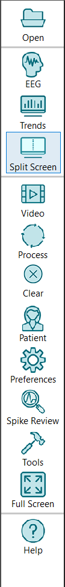

# System Button Bar

# **System Button Bar**

The System Button Bar is used to make global selections.

**Open:**
This brings up a standard Windows dialog for opening an EEG recording file. If a file is currently open this will close that file and open the new one.

**Show EEG:**
The EEG view window will be shown and the Trend view window will not be shown.

**Show Trends:**
The Trend view window will be shown and the EEG view window will not be shown.

**Split Screen:**
Both the EEG view and the Trend view windows will be shown separated by a splitter bar. Choices in settings determine how they are positioned relative to one another.

**Video:**
Toggles the Video Player window. The Video Player shows video synchronized with the EEG waveforms and the trends.

**Process/Pause:**
Perform
processing on the current record. This will simultaneously perform seizure detection, spike detection, and trending. If the record has previously been processed this will begin where that processing left off. It will process new data as it arrives if the record is currently being acquired. When the record is being processed a second press of this button will pause the processing.

**Clear:**
The calculated trends are cleared.

**Show Patient****:**
Displays the patient and recording information present in the EEG record.

**Preferences****:**
Displays a choice of General
Preferences, Trend Preferences (for the currently opened EEG), or Modify Template (for modifying and saving changes to the trend display)
. Clicking on each brings up a dialog for changing the settings for the program.

**Spike Review:**
Opens the Spike Review Window.

**Tools:**
Presents a list of additional available programs and capabilities.

**Full Screen:**
Puts the program into full screen mode. Once in this mode clicking again puts the program into normal view mode.

**Help:** Brings up on line help system.

