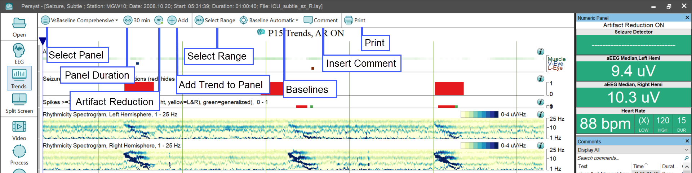
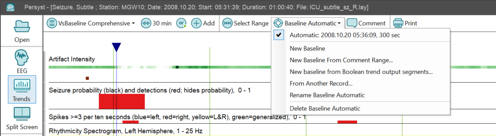
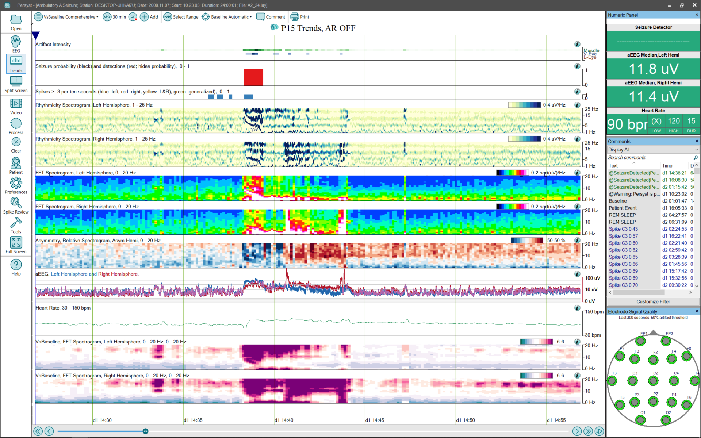
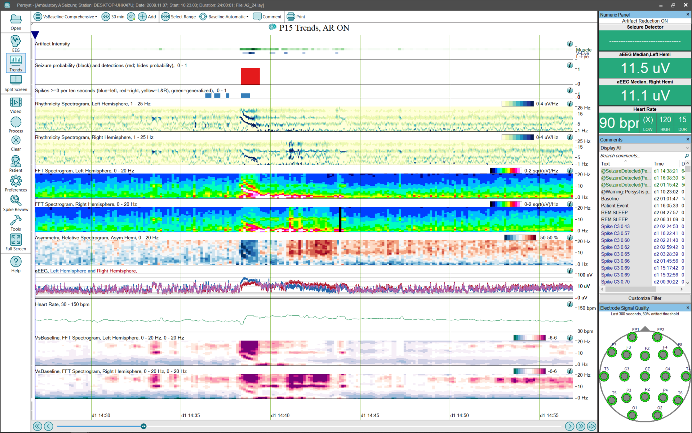

# Trend View

# **Trend View**

The Trend View displays a set of qEEG trends calculated from the currently opened record. When no record has been opened or the record has not been previously processed the display is blank. If the currently open record has previously been processed the trends are displayed. When the Process button on the System Button Bar is pressed the trends are displayed as they are calculated. If new data arrives the trends are updated to reflect it as long as the Pause button is not pressed.

A scroll bar at the bottom of the Trend View moves the display forward and backward in time. The “Play” button to the right of the Scroll Bar causes the display to automatically scroll as new data arrives. Pressing the “Play” button a second time stops the automatic scrolling.

When an area in the Trend View is clicked that is not designed for making changes the cursor is moved to that point in time. The Trend View and the EEG view are synchronized to the same point in time.

The Trend View Button Bar is used to make selections  specific to the Trend View:

Select Panel: Selects a panel of Trends to be displayed. All the panels defined in the Trend Settings are displayed. There are also options to add a new panel, delete the current pane l, or rename the current panel.

Duration:  Selects the amount of time repr esented by the horizontal axis.

Clear: The calculated trends are cleared.

Add: Brings up a dialog to select a trend to add to the currently displayed panel.

Comment: Enter a Trend Comment at the current cursor position. (Trend Comments have an @PersystTrends suffix added automatically to the comment text and are displayed at the bottom of the trend page.)

Print: Print the current trend page.

Baselines: Mark a range in the trend to set a baseline for statistical trends.

New Baseline: Mark a range in the trend to set a baseline manually.

New Baseline From Comment Range: Mark a range in the trend to set a baseline using an existing duration annotation/comment.

From Another Record: Manually open another recording to use an existing baseline from that record.

Rename Baseline […]: Rename the currently selected baseline.

Delete Baseline […]: Delete the currently selected baseline.

Changes can be made to the panel by clicking on various locations.

Clicking on the title of a Trend brings up a settings dialog for that Trend

Clicking on a channel group in a Trend brings up a list of channel groups tha t can be applied to that Trend.

Clicking on the frequency range in a Trend brings up a dialog to change the frequency range for that Trend and for all Trends on the Panel based on the same Calculation Engine.

Clicking on the color spectrum in the Trend title brings up a dialog to change the color spectrum for that Trend.

Clicking and holding the mouse down on a Trend allows the Trend to be dragge d to new location in the Panel.

Right clicking on a Trend brings up a context menu.

Artifact Reduction: This is a toggle that turns Artifact Reduction on and off. When Artifact Reduction is on the Trends are calculated fro m Artifact Reduced waveforms.

   
*Artifact Reduction OFF*

*Artifact Reduction ON*