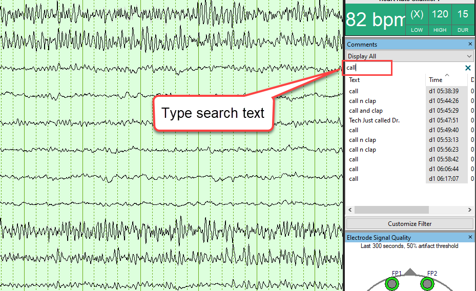
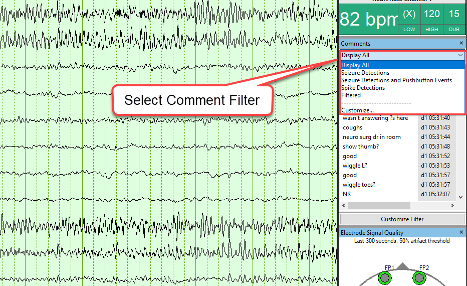
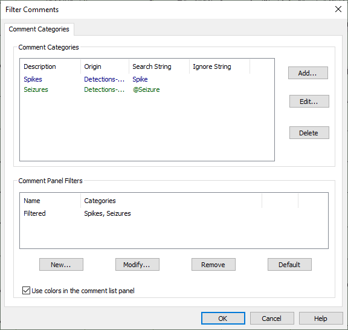

# Comment List

### **Comment List**

Events can be reviewed in succession by using the
Comment List. Use the Down key to select the next event in the list. Use
the Delete key to delete the current event and select the next event.
Search for events by typing in the Search box at the top of the Comment
List.

Click on a column
heading to change the sort order.

Jump to an event
by clicking on it. Delete it by pressing the DELETE key.

The comment
**Origin** describes
where the event was created, e.g.,
by the Detector or the recording system.

Use the Comments drop-down to display a subset
of comments  
  

**Display**
**All:** Show
all comments

**Seizure**
**Detect****ions****:** Show Persyst
Seizure Detection events only

**Seizure
Detections and Pushbutton Events:** Show
Persyst Seizure Detection events together with pushbutton events. (May
require modification of the Comment
Categories if
the default OEM pushbutton events are not filtered with this selection.)

**Spikes:**
Show
spike events only

**Filtered:**
Show
a subset of comments based on filter settings (select Preferences|General
Preferences|Comment
Categories.

**Customize Filter:**
Select or de-select Comment Categories that are specified in the currently
selected Comment Filter created under Preferences|General Preferences|Comment
Categories.

