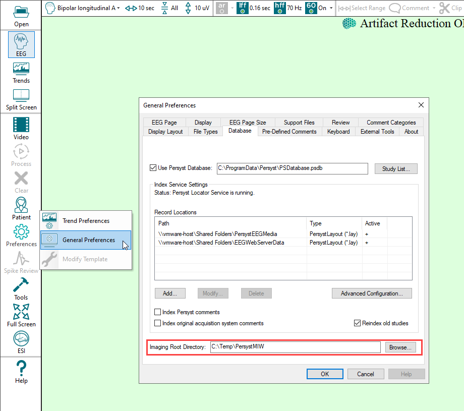
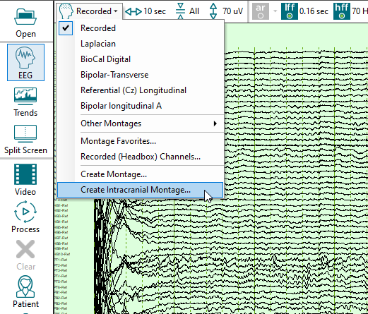
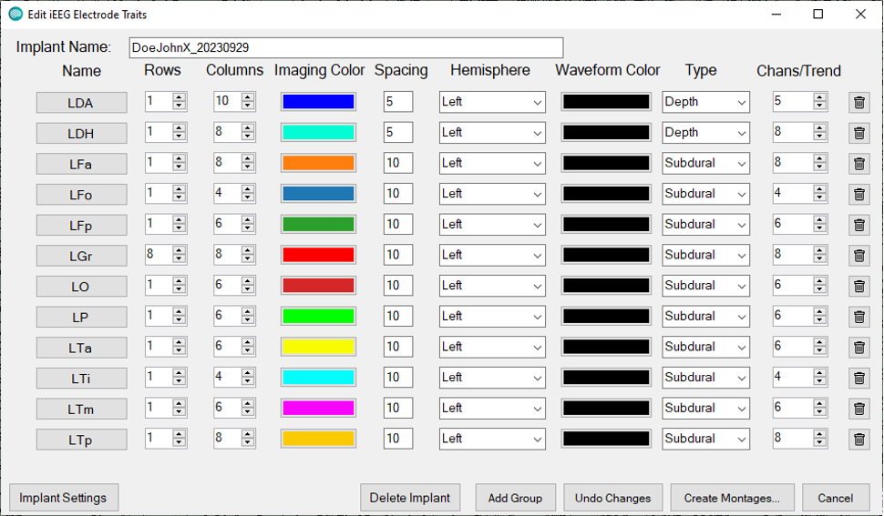
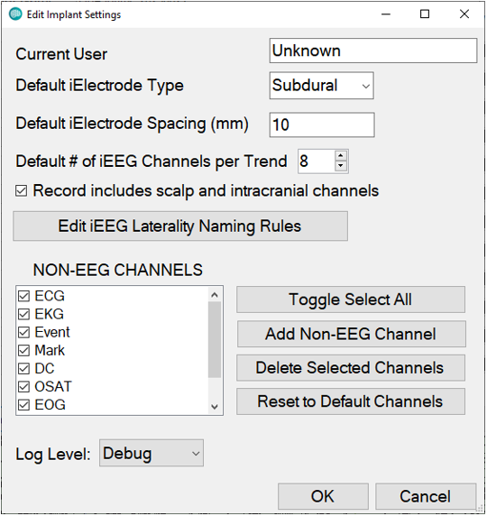
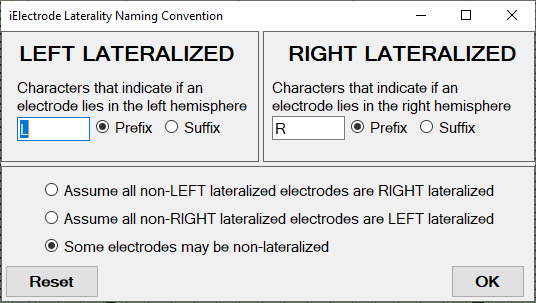
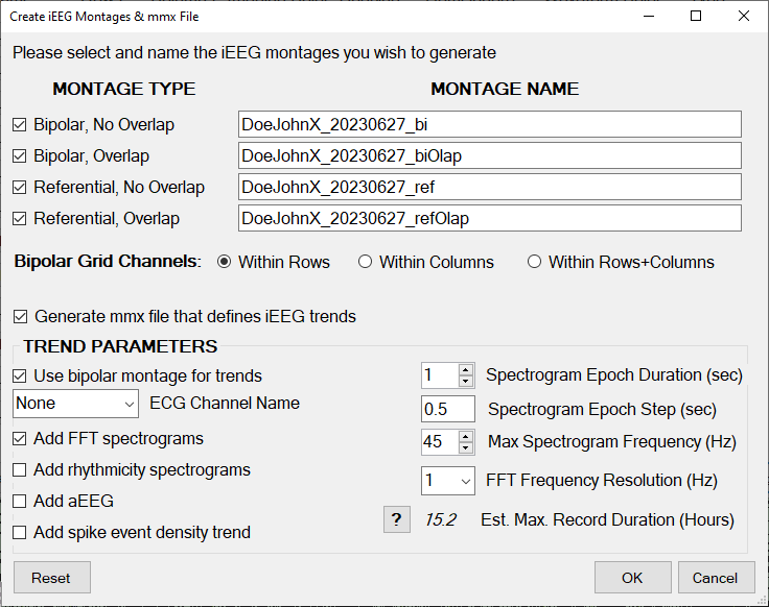
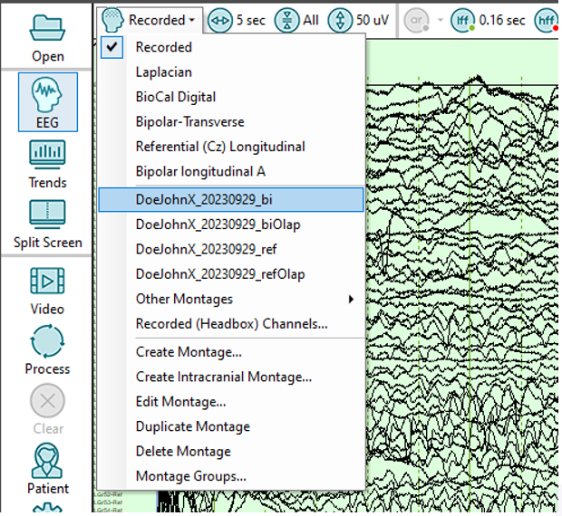

# Create A New Intracranial Montage

### **Create a** **New Intracranial Montage**

**Persyst 15**includes a utility for creating intracranial EEG (iEEG) montages and Channel Lists that can be used for the creation of trends.

- Intracranial EEG electrode groups (i.e., all contacts on the same strip, grid, or shaft) and their geometries (i.e., number of contacts, rows, and columns) are semi-automatically identified based on iEEG channel names
- Based on the iEEG geometries, bipolar and referential montages are automatically generated. In addition, overlap montages are generated whereas groups of 3-4 spatially neighboring channels can be visualized as overlapping waveforms to increase the number of channels that can be simultaneously visualized.
- Channel Lists are automatically generated to facilitate trending of iEEG data by creating groups of channels to be analyzed in a single trend. Specifically, each iEEG hardware group is split into user-defined subgroups of neighboring channels that can be individually analyzed.
- An mmx file, that defines a set of user-modifiable trends can be automatically generated to facilitate trending of those Channel Lists and individual channels.

Intracranial montages are patient-specific, and are saved in the Persyst Imaging Root Directory so that they are automatically made available when the records from the patient are re-opened in Persyst.

This folder is configured by selecting Preferences|General Preferences and then the Database tab. In practice, this will be a folder location that can be accessed by other acquisition and review instances of Persyst, e.g., a UNC path to a folder on the EEG file server. In this example a local folder has been configured.  
  

From the EEG View, select the Montage button on the EEG Button Bar and then select **Create Intracranial Montage**
.

The Edit iEEG Electrode Traits dialog is displayed where the EEG channel groups are displayed by the Channel Label Prefix.

The Implant Name is derived from the patient name and the current date and may be edited. This is the prefix name that will be given to each montage generated for the implant.

Name: Channel Labels by prefix.

Hardware Group Rows: Channels with the same name prefix are assumed to be part of the same piece of electrode hardware and are grouped together in rows. Rows are ordered alphabetically by default, but the order can be changed by clicking and dragging.

Rows: The number of rows for each electrode hardware group. This value will need to be manually edited for grids.

Columns: The number of columns for each electrode hardware group. This value will need to be manually edited for grids. 

Imaging Color: The color code to be assigned to each electrode hardware group when visualized in neuroimaging (used only for the Persyst Multi Imaging Workflow program).

Hemisphere: Designate Left, Right or Non Lateralized.

Waveform Color: The color of the group’s waveforms

Type: Designate Depth, Subdural, or Unspecified (used only for the Persyst Multi Imaging Workflow program).

Chans/Trend: Designate the maximum number of channels to be assigned to a Channel List before creating a new Channel List for the selected electrode hardware group (Channel Lists are used to trend groups of channels as a single trend).

Trash icon (delete): Remove the electrode hardware group from montage creation. This does not delete the channels, and only removes them from being included in the montages generated. For example, the "C" labeled channels in this example are unused and can be removed from the montage creation.

Implant Settings: Set general preferences for new implant montages.

Record includes scalp and intracranial channels: If selected, channels with conventional 10-20 electrode names will not be treated as intracranial.   
  
Non-EEG Channels: Channels with these names will not be treated as intracranial.  
  
Edit iEEG Laterality Naming Rules: Set defaults for assigning Left or Right Hemisphere based on the channel label prefix or suffix.

Delete Implant: Delete the montages and Channel Lists for this implant from the Imaging Root Directory.

Add Group: Manually create an electrode hardware group.  
  
Create Montages: Create Bipolar and Referential iEEG montages for the current implant and optional trend template MMX file. By default, four montages are created and given a name derived from the implant name. “Overlap” means that the waveforms of 3-4 neighboring electrodes are displayed on top of one another to maximize the number of channels that can be simultaneously displayed.

Note that for grids, the vertical order of the channels on the iEEG page reflects their spatial proximity on the grid such that waveforms from electrodes that are physically nearby appear near one another on the iEEG page. For example, with a 2x6 grid, the waveform for channel 6 may appear next to that of channel 12, because those contacts are physically adjacent.

This interface also allows users to create an mmx file that defines trends for these data. Note, if the number of channels or the trend resolution is too high, it is possible that memory limitations will prevent a record from being completely trended. The Est. Max Record Duration(Hours)field estimates how many hours of data could be trended given the current settings before hitting that limit. Values greater than 24 hours should be safe though smaller values may work as well. Contact Persyst support for assistance with finding the limit for your center.

After generation, the iEEG montages will be visible in the montage dropdown menu whenever data from that patient are open.

The iEEG mxx file is created on the desktop and can be used to trend iEEG data from this patient by clicking on Preferences|Trend Preferences, clicking Open, and selecting the mmx file.

