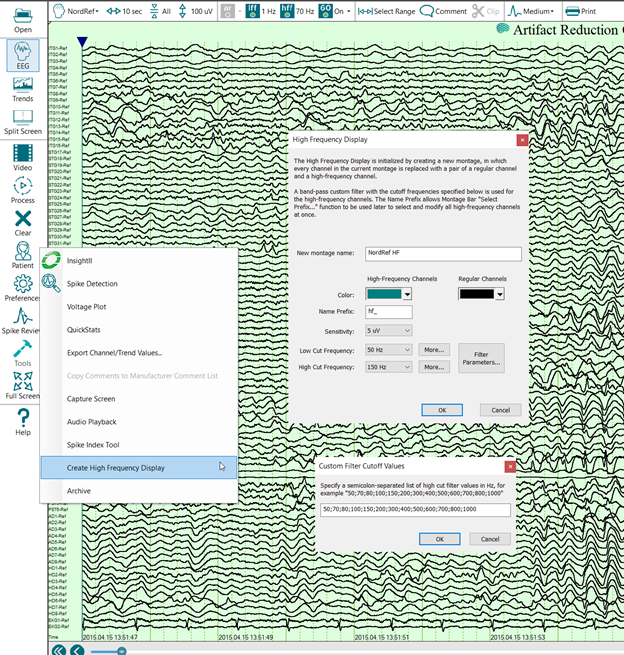
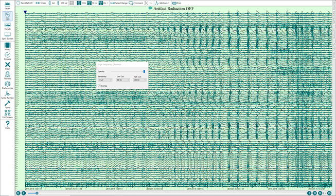
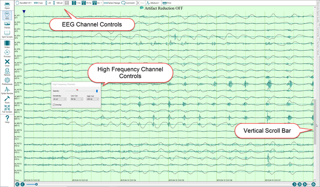
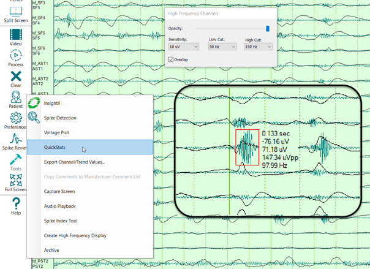

# Create a High Frequency Display

# Create a High Frequency Display

The High Frequency Display tool can be used to display high frequencies with selected gain and filer settings simultaneously with Berger-band EEG waveforms within the same display montage.

The High Frequency Display tool is launched from the Persyst 15 System Button Bar. Select **Tools** and then **Create High Frequency** **Display**.  Select the Low and High Cut Frequency. To view the filter characteristics, select **Filter Parameters**. Select the **More…** button to add additional values for the Low Cut or High Cut filter menu.

Select OK to create the High Frequency Display. Use the sliders and drop-down list to adjust opacity, channel spacing, and gain for the High Frequency Channels (here shown in dark green).

Use the EEG Toolbar at the top of the EEG Page Display to adjust the Seconds per Page and Channels Per Page as desired. Here the EEG display duration has been reduced to 4 seconds and 24 channels per vertical page.   

Use the horizontal and vertical scroll bars at the edges of the EEG window to navigate. Use the Channels Per Page slider to zoom in/out. Select **Tools|QuickStats** to measure individual waveforms.

