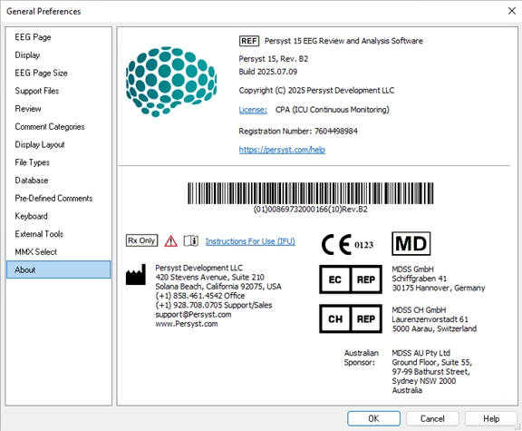

# General Preferences: About tab

# **General** **Preferences****: About tab**

The **About** tab displays the version (e.g., “Persyst 15”), the revision (e.g., “Rev B”), and the build date in YYYY.MM.DD format (e.g., “2025.07.09").

