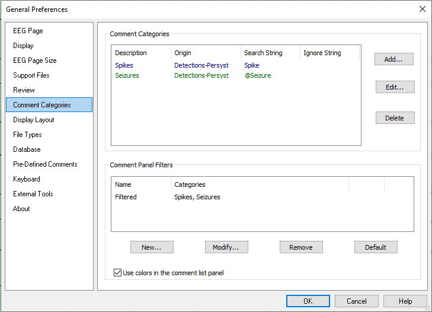
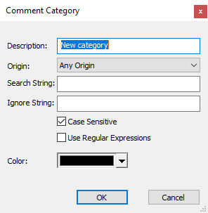

# General Preferences: Comment Categories tab

# **General Preferences: Comment Categories** **tab**

The Comment List has
a drop-down list at the top
to filter the comments displayed by type, e.g., All, Filtered, Spikes,
Seizure Detections and Seizure Detections and Pushbutton Events
.

The Filtered category is used to specify the comments that are listed in the Comment List when its Filtered option is selected.

Comments can be filtered by Origin or by the text within the comment.

Comment Categories

Add: Opens the dialog box below

Description: Label for the Comment Category

Origin: Restrict by origin, e.g., User-Persyst (comments entered from Persyst), User-Recording System (comments entered from the EEG system), Equipment Events (EEG system generated events, e.g., recording start/stop, impedance, etc., Detections-Persyst (Persyst spike and seizure detection events).

Search String: Enter the search text.

Ignore String: Enter text to be ignored (if any).

Case Sensitive: Require matching case.

Use Regular Expressions: Regular expressions allow the use of meta characters that can be used as wildcards or to specifically include or exclude alphanumeric patterns.

Color: Applies the selected color to comments matching the Comment Category.

Comment Panel Filters

New: Create a new Comment Panel Filter to appear at the drop-down list at the top of the Persyst Comment List. Select the desired Comment Categories from the New Comment Filter dialog.

Default: Remove any custom configuration for Comment Panel Filters and restore the defaults.