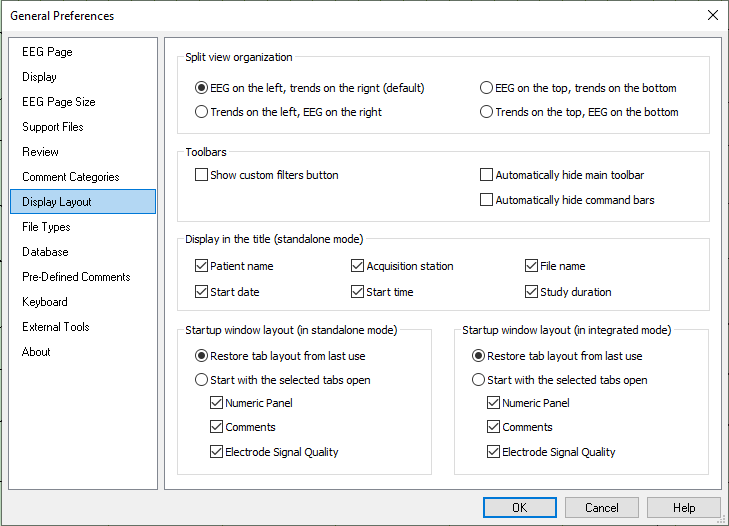

# General Preferences: Display Layout tab

# **General Preferences:** **Display Layout** **tab**

This tab provides options for the Split Screen button on the System Button Bar. Trends and EEG waveforms can be split horizontally or vertically. The default option is EEG on the left, trends on the right.

Options are also provided to s
pecify the information to be displayed in the
Persyst 15 Title Bar.