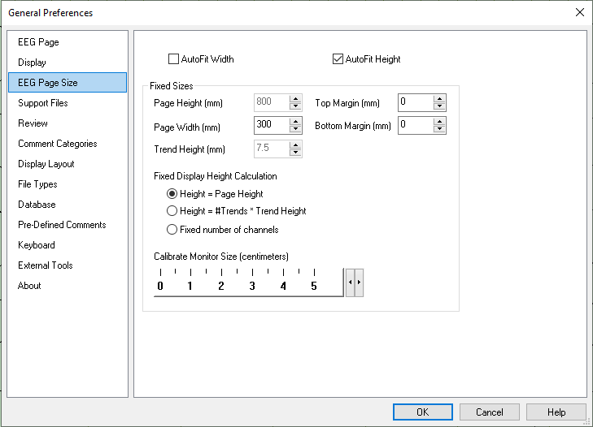

# General Preferences: EEG Page Size tab

# **General Preferences: EEG Page Size tab**

Resizing the main window
and docking dialog bars may reduce the width allotted to the EEGPage. When this happens, the duration of the displayed EEG can be held fixed (e.g., at 10 seconds) by horizontally squeezing the waveforms, or it can be reduced (without squeezing) to fit the reduced page width.

Select **AutoFit Width**
to fix the number of seconds to the
value selected from the Seconds per Page button on the EEG Button Bar
.

Similarly
,
the
height of the EEGPage can be
changed.
Select **AutoFit Height**
to fix
the size of the EEGPage to the current dimensions.

The default option is to select both the **AutoFit Width**
and **AutoFit Height**
options.