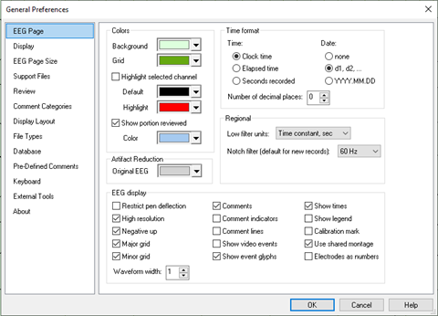

# General Preferences: EEG Page tab

# **General Preferences: EEG Page tab**

Colors: Change the color of the EEG waveform traces and the EEG page color. The Highlight Selected Channel option will change the color of any EEG channel selected on the Montage Bar in the EEG Window.

**Show portion reviewed:** Show a bar in the selected color below the EEG Page scroll bar to indicate which pages of EEG have been viewed.

**Artifact Reduction:** When Artifact Reduction is toggled “on”, the original unfiltered EEG waveforms are displayed with the filtered EEG waveforms. Use the color selector to set the color of the original EEG waveforms when Artifact Reduction is toggled on.

Major and minor grid lines are drawn every 1 second and every 200 milliseconds respectively. Click on the
options for **Major Grid**
and **Minor Grid**
to toggle these options
.

Calibration Mark: Select to display an on-screen voltage reference. Change the position of the calibration mark with a click and drag.

**Comments:** Select to display comments/annotations in the Comment Channel at the bottom of the EEG waveform display.

**Comment Indicators:** Select to display dots along the horizontal scroll bar indicating the position of comments throughout the recording.

**Comment Lines:**
Select to display v
ertical lines indicating the exact time of a comment.

**Negative Up:**
The tracings can be inverted from their normal "negative-up" default. The default option is “selected” for negative-up.

**Restrict Pen Deflection:**
Select to limit waveform excursion to the vertical width of each channel. If this option is not selected, then waveforms can traverse the entire vertical range of the waveform display.

**Low Filter Units:**
Select to display the Low Filter setting in seconds (time constant) or by frequency in Hertz (Hz).

**Show Event Glyphs:**
Include non-alphanumeric characters in the rendering of comment/annotation text.

**Show Video Events:**
De-select to hide system video events (e.g., EEG system generated comments indicating the start of a new video file segment). Default is “de-selected”.

**Show Cursor****:**
Select to place a cursor where the mouse pointer is clicked on the EEG waveform display. Default is “selected”.

**Electrodes as Numbers:**
Toggle the display of EEG channel labels with the raw amplifier channel number. Default is “de-selected”.

**High Resolution:**
Select to display all samples regardless of sampling rate or screen resolution. If the number of samples exceeds the horizontal pixel resolution, then the vertical traversal of the waveform will fill in the vertical row of pixels from the waveforms minimum to maximum traversal. Deselect to show only one sample per pixel. Default is “selected”. *This should only be used to review EEG at very slow chart speeds; otherwise, high frequency waveforms may be aliased as low-frequency waveforms.*

**Show Legend:**
Display a vertical scale at the right-end of each channel.

**Waveform width:**
Change the thickness of the EEG waveform traces.

**Times****:**
Select to show times
in the comment channel.

**Time Format options:**

**Clock Time:**
Time indicators (e.g., times displayed in the comment channel, the scroll position shown in the status bar or the time of an event) can be switched between *elapsed time*
, measured from the start of the trial, and *clock time*
, the actual time of day noted by the recording system.

**Date:**
Select to show the date as “YYYY.MM.DD” or “D1, D2,…” along with the time in the comment channel.

**Second Resolution:**
Select the number of decimal places for the second resolution.

**Elapsed Seconds:**
Select to show the number of elapsed seconds vs.
the Clock Time or the Elapsed Time.