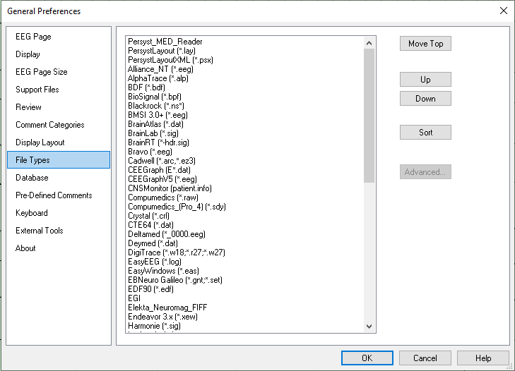

# General Preferences: File Types tab

# **General** **Preferences: File** **Types tab**

This tab provides options to re-order the list of file types, e.g., to place your most-used file types at the top of the list
using the **Move Top**
, **Up**
, and **Down**
buttons
.

**Sort:**
Re-alphabetize the list.

**Advanced:**
Additional file type options, e.g., Xltek (erd) options allow for additional database fields to be read from the Xltek/Natus/Neuroworks EEG and indexed by the Persyst Database.