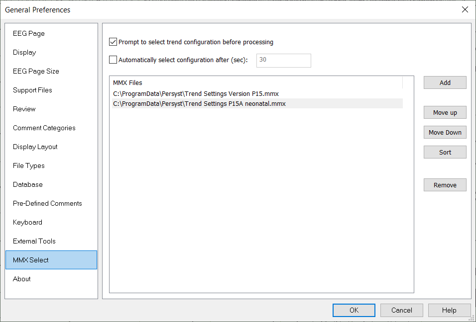

# General Preferences: MMX Select

# **General** **Preferences****: MMX Select**

The **MMX Select**tab is used to select a list of trend template (mmx) file(s) for processing. This option is applicable for both on-line and off-line EEG processing.

**Add:** Add a trend template MMX to the list.

**Move Up/Move Down/Sort:** Change the order of trend template files in the list.

**Remove:** Remove the selected trend template MMX.  

**Prompt to select trend configuration before processing:** Display a dialog before processing to select a trend template MMX.

**Automatically select configuration after (sec):** If no selection is made, process the recording using the trend template MMX at the top of the MMX Files list.