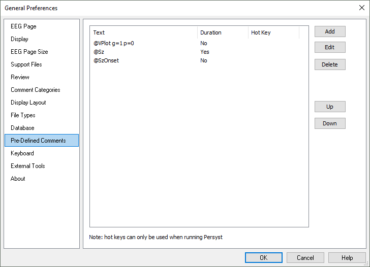

# General Preferences: Pre-Defined Comments

# **General Preferences: Pre-Defined Comments**

Use the Pre-Defined Comments dialog to create custom comments that can be placed with a function key or other custom keystroke.

Note that this functionality is available only when running Persyst stand-alone, and not within an OEM EEG system integration.