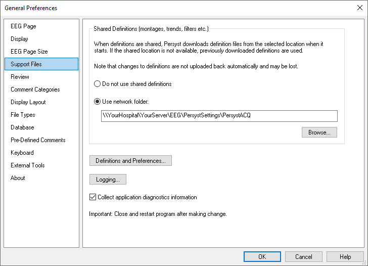
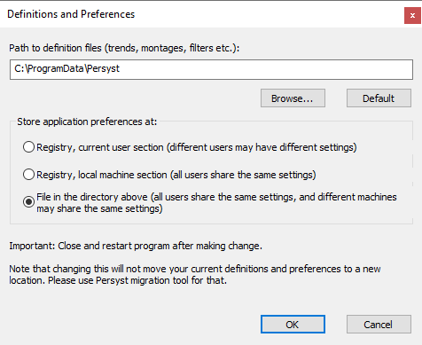

# General Preferences: Support Files tab

# **General Preferences: Support Files tab**

**Path to definitions files:**
Use the Browse button to specify a location other than the default one.
Settings files include
:

- Program preferences: PersystPreferences.xml
- EEG waveform m
  ontages
  and Channel Lists: PSMontageTemplates.xml
- Trends and Trend Panels: \*.mmx (default is “
  Trend Settings Version P15.mmx
  ”
  )

Important: A local hard disk folder should be used for the Settings Files if there is any possibility that a shared network location will be unavailable (e.g., a portable EEG system).

**Store application preferences at:**
Application preferences include the Path to definitions files settings, page color, favorite montages, and General Preferences settings. These can be stored in the Windows Registry (Current User or Local Machine) or in a preference file saved in the “Path to definitions files”
folder described above.

- Registry, current user section: Each Windows user has individual preferences
  . Note that m
  anaging settings
  for each individual user can significantly increase the complexity of deployment and management,
  so this option is not recommended
  for acquisition or review stations that use different Windows user logins for multiple users
  .
- Registry, local machine: All Windows u
  sers share the same preferences
  .
- File in the directory above: All Windows users share the same preferences in a Preferences File. This is
  the default setting and it is
  recommended for Windows 7
  or higher
  .