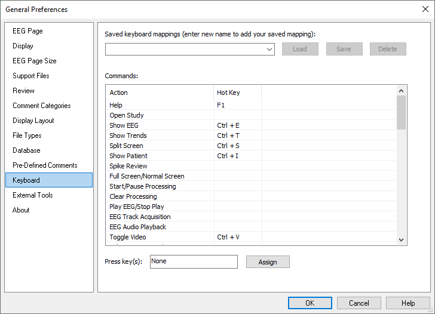

# General Preferencres: Keyboard tab

# **General** **Preferences****: Keyboard tab**

This tab provides options for assigning your own hotkeys for various commands in Persyst. Select a command and then press the desired key (or combination of keys, e.g., Ctrl+O can be assigned to “Open Study”, and so on.

Enter a name for your keyboard mapping to activate the **Save**
button. Select **Load**
to open a saved keyboard map or Delete
the selected keyboard map.