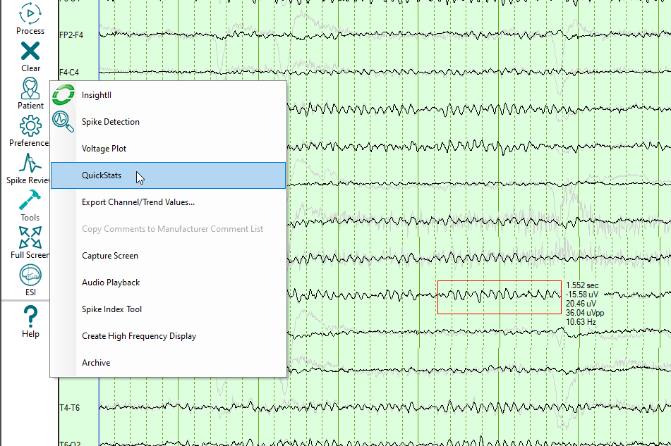

# Measure Amplitude and Frequency

# Measure Amplitude and Frequency

Select Tools
and then QuickStats to make measurements
of amplitude and frequency. After selecting QuickStats, left-click-and-drag
a box around the waveform of interest from top-left to bottom-right. Release
the left mouse button and the values for voltage and frequency of the
waveform within the box will be displayed.

Note: Select only one waveform
at a time for measurement. Multiple waveforms cannot be measured within
a single box. Instead, hold
down the Ctrl-key when selecting the QuickStats tool to leave the previous
measurements on-screen while making subsequent measurements.

Measures displayed are:

Duration of the marked area

Maximum negative amplitude

Maximum positive amplitude

Peak-to-peak amplitude

Average
frequency

