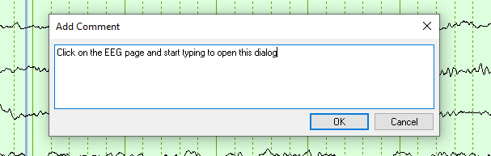
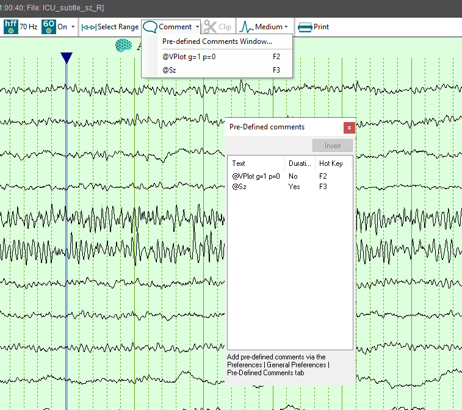
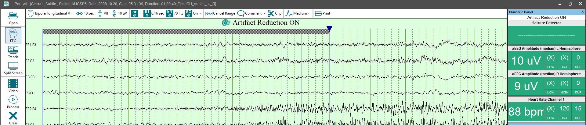
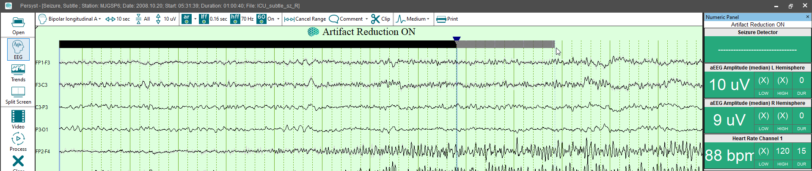
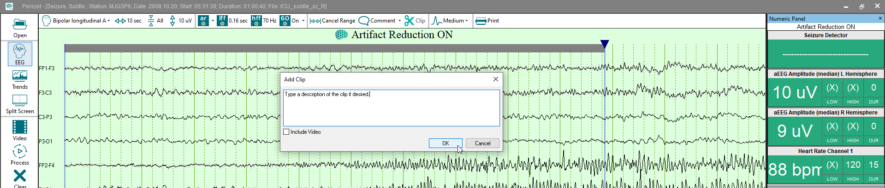
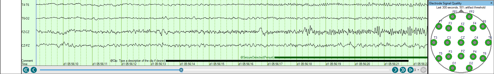
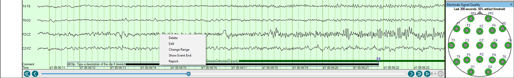

# Note Points and Ranges of Interest

### **Note Points** **and Ranges** **of Interest**

**Mark
events** **and**
**make comments**

**AutoComment**

Click
on the EEG page and just start
typing to add a new comment. The comment will be positioned at the
position
of the caret
(changed by clicking on a different
location on the EEGPage).

### **Use** **Pre-Defined Comments**

Select the drop-down arrow to the right of
the Comment button to select any of the Pre-Defined Comments and they
will be added at the cursor position (see General
Preferences: Pre-Defined Comments on creating your own pre-defined
comments).

Create Pre-Defined Comments by
assigning a hot key to a specific
event. When you press the hot key,
the comment will automatically be inserted.

**Note**:
The F1 (Help) and F10 (Menu) function keys are used by Windows, so you
will not be able to use them for Pre-Defined
Comments.

After you have
added a comment, you may still edit its text or position. To change its
position, select the comment and drag it to a new position in the EEG.
To edit or delete a comment, select the comment on the EEG and click the
right mouse button to display its Context menu.

You may also
edit an event by double clicking on it.

**Mark
a Range**

Use
**Select Range** to create a comment with a
duration. When Select Range is clicked, a cursor with a black caret at
the top appears on the page. Click on the left caret and drag it to adjust
the start time of the Range. Click on the right caret and drag it to adjust
the end time of the Range.

To
mark a Range greater than the page length, begin scrolling using the scroll
bar or the keyboard. Alternatively drag the caret to the far end of the
page. The EEG page will scroll in that direction. Continue dragging the
Range caret until the desired start time or end time is reached. The start
time and end time of the Range can be repeatedly adjusted by scrolling,
or by dragging the respective caret at the top of the range cursors.

Select the Comment
button to annotate the Range. Alternatively, if the Range has been marked
for exporting clips of EEG using the Persyst Archive Tool, select the
**Clip** button to an

notate the range with the
prefix “@Clip”. If marking to clip for archive, optionally select Include Video.

Type a description of the
clip if desired.

Select
**OK** to
write the duration comment to the Persyst Comment List. The comment will
also appear at the bottom of the EEG page with a line extending to the
right for the duration of the comment.

Double-click
on a comment to edit the comment text Click-and-drag the start or end
of the comment to adjust the duration. You can also right-click on the
comment to Delete, Edit, Change Range, or Show Event Start/End.

**Note**:
You may edit or delete Comments added during
the recording of the EEG, but your
changes will not be saved.