# Open a record from Persyst Database

# **Open a record from Persyst Database**

The Persyst Database is used to simplify opening of EEG recordings for review by listing recordings from one or more locations or for one or more EEG file types.

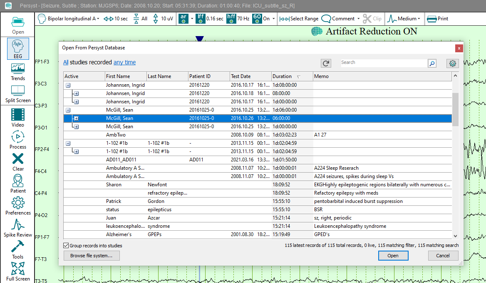

The Persyst Database is enabled and configured by selecting **Preferences**, **General Preferences**, and then the **Database** tab.

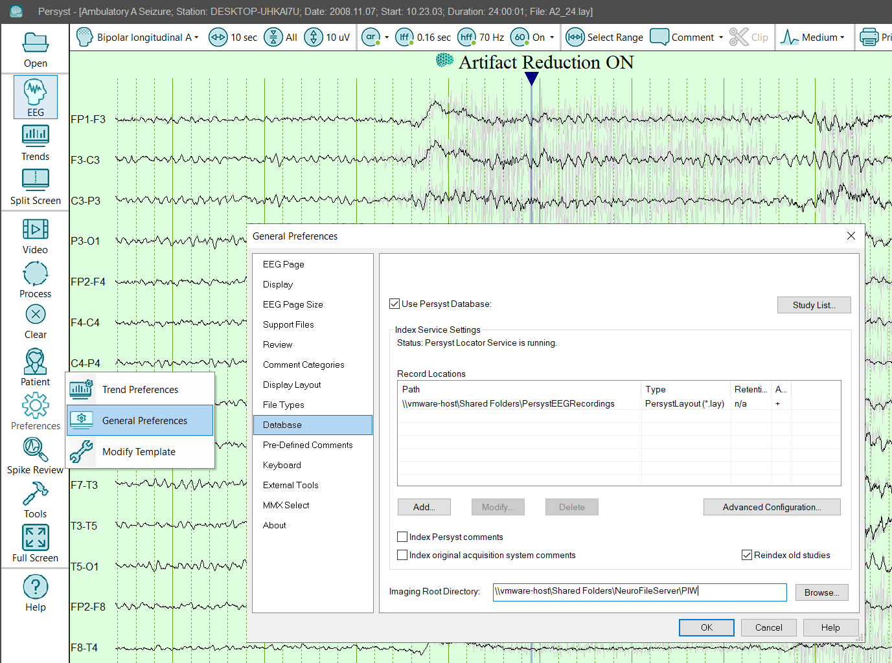

**Use Persyst Database:**Enables the Persyst Database.

Index Persyst Comments: Selecting this will index all comments entered in Persyst and make them available for search in the Persyst Database.

Index original acquisition system comments: Selecting this will index all comments entered in Persyst and make them available for search in the Persyst Database.

Note: Options to Index Persyst comments and/or Index original acquisition system comments are available in the Database configuration dialog. These are not enabled by default as they may significantly increase the index size and time required to index the EEG recordings.

Reindex Old Studies: Selecting this will re-index studies that are more than 6 days old and enumerate files in a folder regardless of the folder's last modified time. If indexing comments is selected then they will be re-indexed as well.

**Add:**Add file locations and EEG file types to be indexed and listed in the Persyst Database.

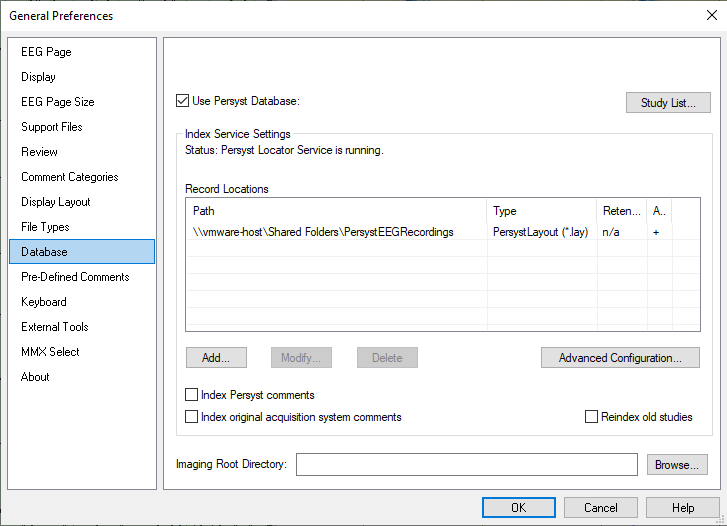

When browsing to network file locations use a UNC (e.g., \\server name\\folder name). Do not use mapped drives (e.g., network drives with a drive letter) for the file path or the EEG recordings will not be listed in the Persyst Database.

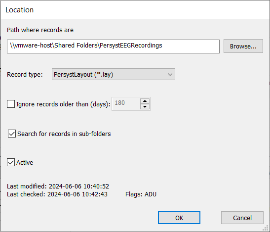

**Path where recordings are:**Local drive or UNC path. Do not use mapped network drive letters.

Ignore records older than (days): Set the maimum record age (determined by the file properties date). This is typically used with very large recording database with many thousands of records.

Search for records in sub-folders: Default (selected) will search sub-folders. De-select to restrict the index to the folder specified.

Active: Default (selected) will index this location. De-selecting will suspend updating the index of this location.

Note: If EEG recordings are not listed in the Persyst Database then the PSLocator.log file will list any error messages that were encountered. From the Database configuration tab, select **Advanced Configuration** and then select **Show** to view the contents of the PSLocator.log file.

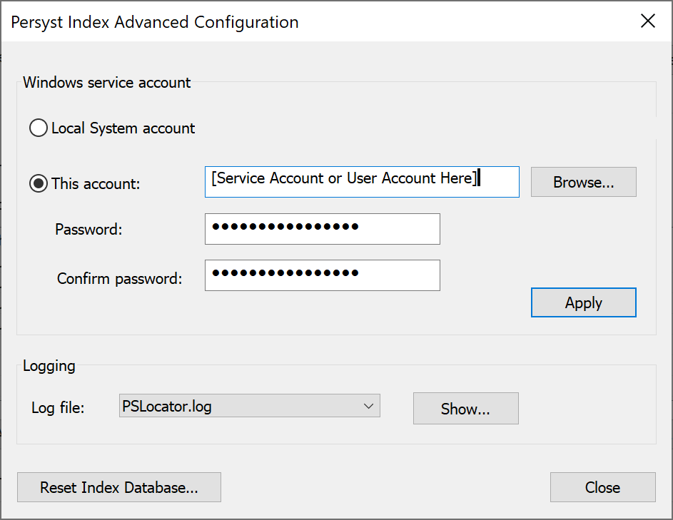

The default selection for the Windows service account is the Local System account. If the network location(s) for EEG recordings require a different User Name and Password to access these locations, then this can be configured through Windows Services. Restart the Persyst Locator Service after selecting a new Log On account.

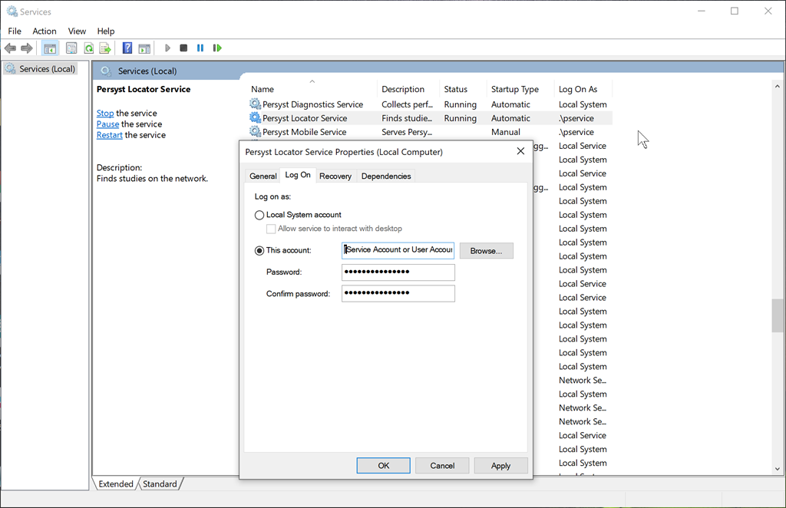

After the Persyst Database is enabled and configured, it will list EEG recordings at each of the file formats and locations listed. Select the **Open** button from the Persyst 14 System Bar to launch the Persyst Database. Select a recording and then **OK**. Alternatively, use the **Browse file system** button to open recordings directly from the file system.

**Search****:** Restrict the studies displayed by the search term. As you type, only recordings that include the search term are displayed.

Note: Options to Index Persyst comments and/or Index original acquisition system comments are available in the Database configuration dialog. These are off by default as they may significantly increase the size and time required to index the EEG recordings.

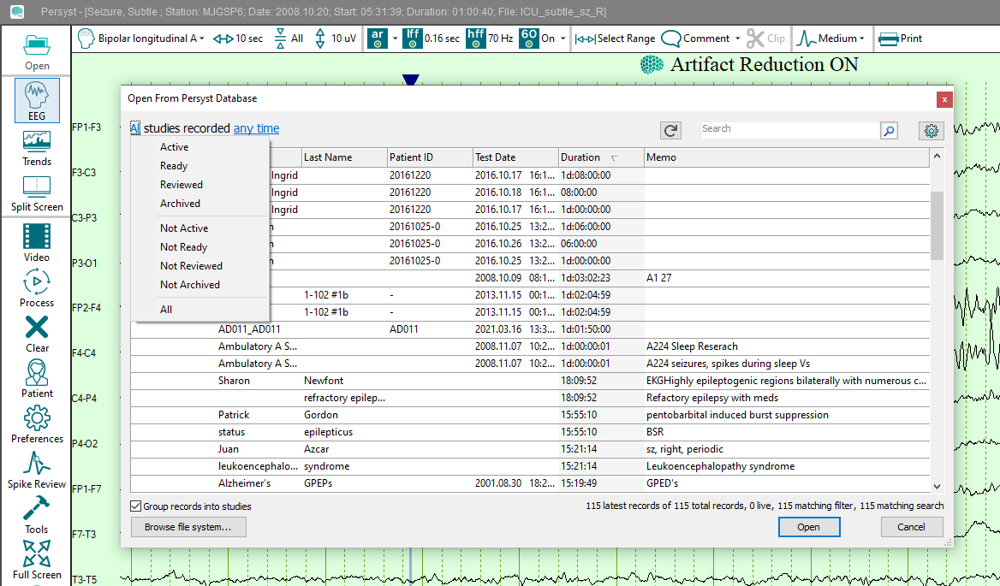

**All****:** Show all studies. Select to change the state filter:

**Active****:** Studies that are currently recording (on-line). **Not Active** inverses this selection.

**Ready****:** Studies that have been marked as “Ready” by selecting this option through the Show Patient button on the System Button Bar. **Not Ready** inverses this selection.

**Reviewed****:** Studies that have been marked as “Reviewed” by selecting the option through the Show Patient button on the System Button Bar. **Not Reviewed** inverses this selection.

**Archived****:** Studies that have been marked as “Archived” by selecting the option through the Show Patient button on the System Button Bar. **Not Archived** inverses this selection.

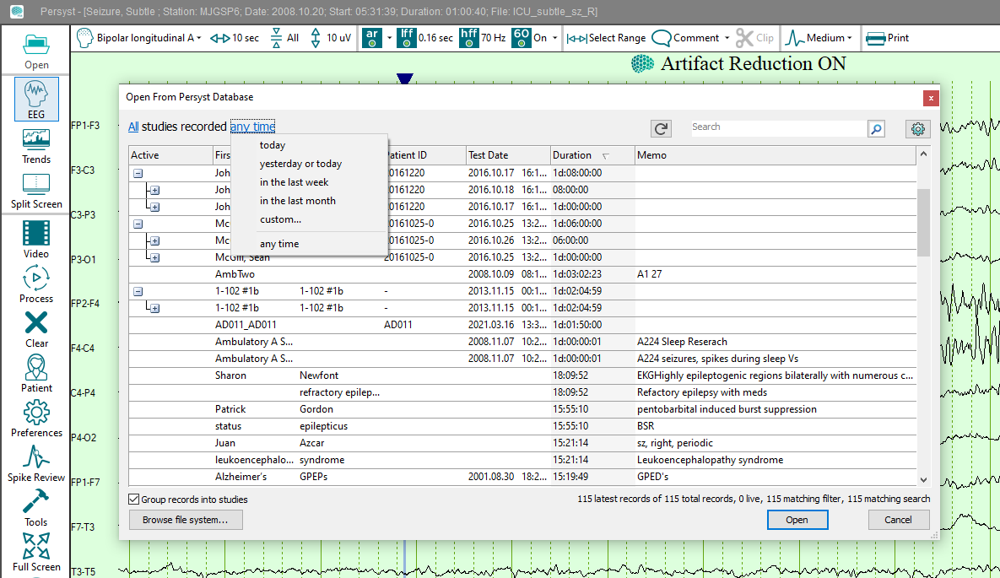

**Any time****:** Show all studies. Select to change the date filter to today, yesterday, last week, or a custom date range.

Configuring the Study List

Select the Preferences button to change the categories and order of information displayed in the Persyst Database.

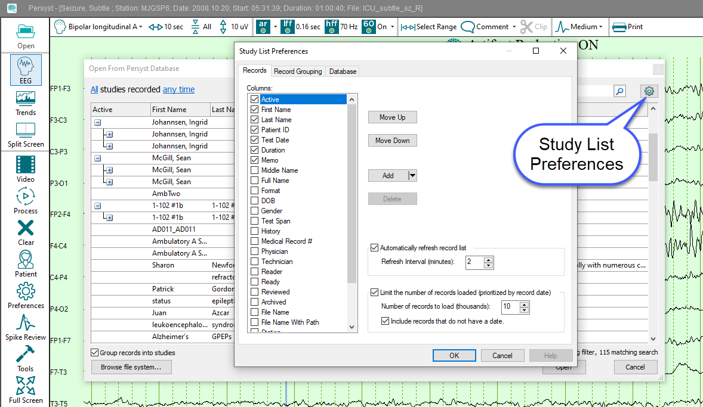

**Display columns and order****:** Demographic fields ready from the recording can be selected for display and searched for in ascending or descending order by selecting the column.

**Automatically refresh record list:** Interval at which the list of studies displayed is refreshed when the database window is open.

**Limit the number of records loaded (prioritized by record date):** Set a limit on the number of recordings indexed by the Persyst Database and by Persyst Mobile (default is 10,000 records).  
Note: with very large patient databases, setting this number to a lower value can reduce the time required to load a list of patient recordings in the Persyst Mobile Client.

**Include records that do not have a date:** Select to list recordings that have been de-identified or otherwise do not display a date value in the Persyst Database.

**Record Grouping**

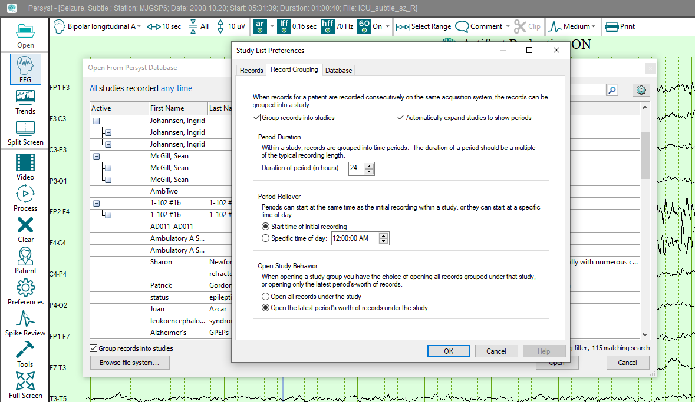

**Group records into studies:** Display and open record segments together as a continuous trend and EEG waveform display based on patient demographics (e.g., patient name and patient ID). When selected, a “+” sign will be displayed next to the first record in a series. Selecting the “+” button will expand the list of recording segments

**Automatically expand studies to show periods:** A recording day or review period may be comprised of multiple recording segments. The Period Duration (hours) will group recording segments into discrete recording periods. For example, if recording segments are 4 hours long and the Period Duration is set to 24 hours, then each recording period will be shown with a "+" sign next to the recording, and expanding that will list the 6 recording segments within the recording period.

**Period Rollover:** The recording period can be set to start at the same time as the initial recording or at a specific time of day.  
  
Open Study Behavior**:** Select an option to open all records under the study as one continuous trend and EEG from the beginning of the study, or open only the recording segments from the current period.

**Database:** This is the same dialog available through Preferences|General Preferences from the Database tab. It is also made available here for configuring the Persyst Database when launched directly from its desktop icon.

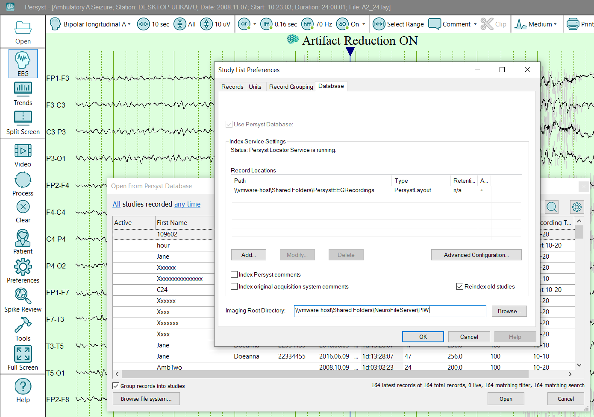  
  
  
**Units**  
  
Persyst 14 Rev.D and later adds a Units tab to the Study List Preferneces dialog. This is used to assign acquisition systems and/or file folders to automatically designate recordings from those acquistion systems, or that are stored in those file folder locations, to a Unit for organization within the Persyst Database and in the Persyst Mobile client Patient List display.  
  
Select Add to create a new Unit designation or Edit to modify an existing one. Use the Move Up and Move Down buttons to reorder the list. (The list order in Persyst Mobile is set separately in the Persyst Mobile Client.) Select Delete to remove a Unit designation.

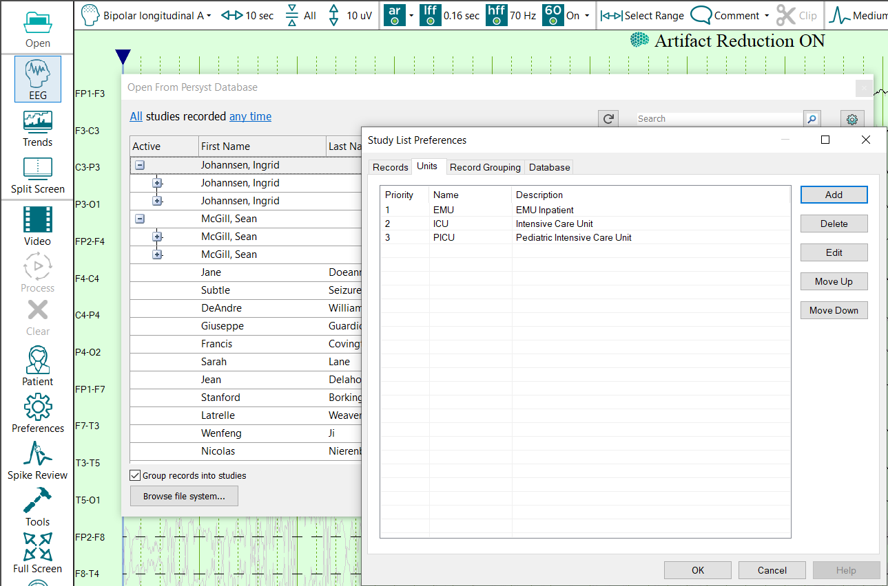

Add/Edit Unit Dialog Description:   
  
Select Add to create a new Unit designation, or Edit an existing one.   
  
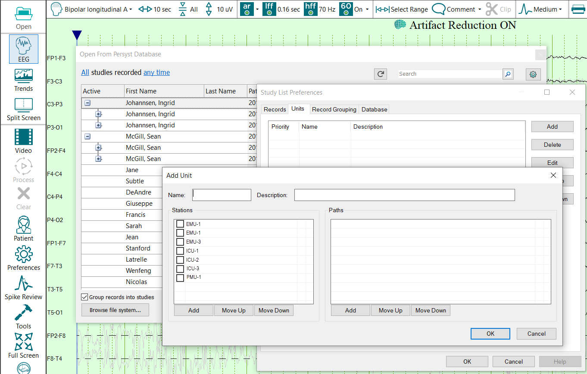

**Name:** The name of the Unit designation, e.g., EMU, ICU, etc.

**Description:** Add a more descriptive label (optional).

**Stations:**Use when assigning recording systems to a Unit. Leave blank if designating a Unit by file path(s) instead.  
  
Paths**:** Use when assigning a UNC path (e.g., \\yourhospital\fileserver\EEGStore\ABCHospitalEMU\). Note: Do not use mapped drive letters because the Persyst Database requires the use of UNC network file paths.

**Move Up/Move Down:** Move the display order of Stations or Paths within the dialog (optional).

**Custom Database Fields**

Some file formats have additional information fields that can be added to the Persyst Database. Currently, additional fields in Natus Neuroworks EEG file formats are supported.

Select Preferences|General Preferences and then the File Types tab. Select the file type to see if additional fields are available. Here, the Natus Neuroworks Xltek file type has been selected and an additional field for StudyName created. Once added, this field can be added from the Persyst Database column selection.

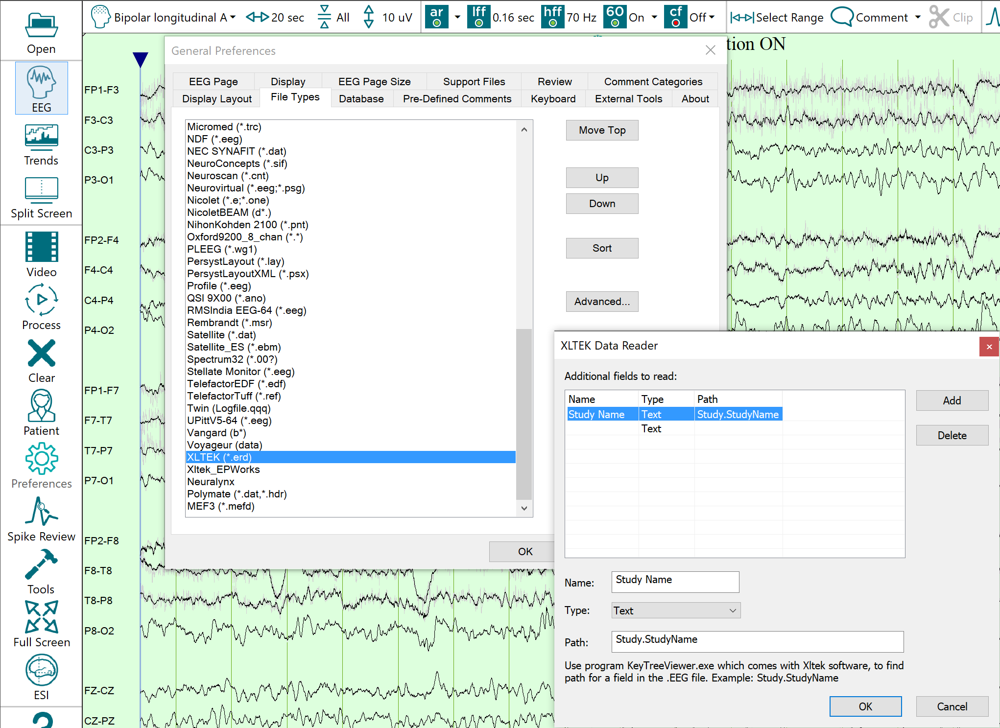