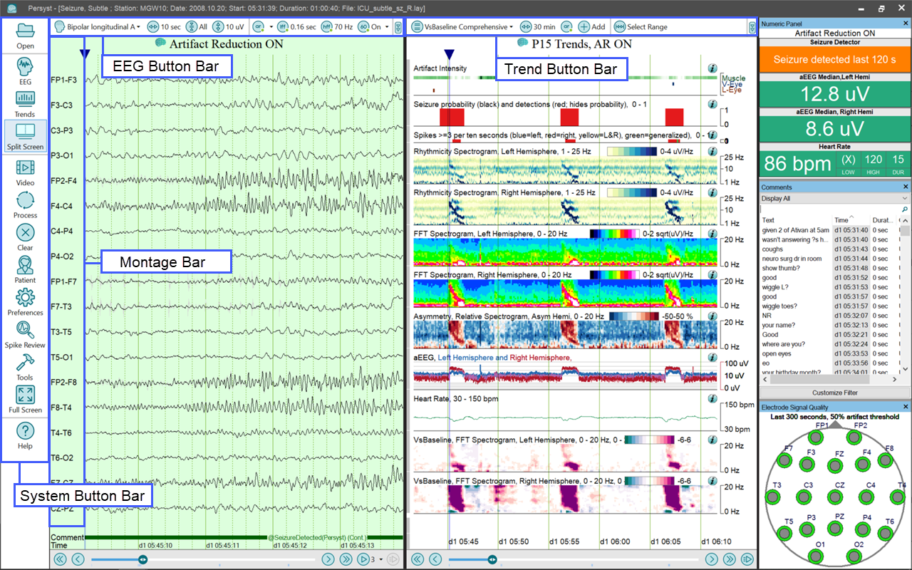
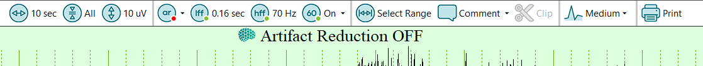
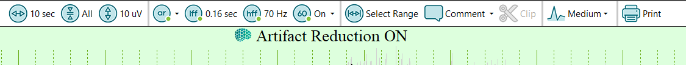
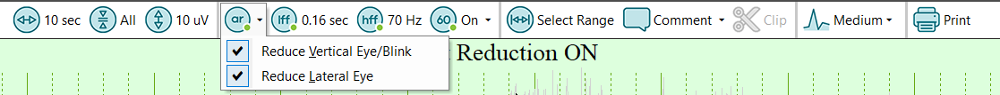

# Screen Elements

### **Screen Elements**

There are three tool bars on the Persyst display. The **System Button Bar** is always visible. The **EEG** **Button** **Bar** is shown when the EEG traces are displayed. The **Trend** **Button** **Bar** is shown when the EEG trends are displayed.

**System Button Bar**

The System Button Bar is used to make global selections:

**Open:**
This brings up a standard Windows dialog for opening an EEG recording file. If a file is currently open this will close t
hat file and open the new one.

**Show EEG:**
The EEG view window will be shown and the Trend
view window will not be shown.

**Show Trends:**
The Trend view window will be shown and the EEG
view window will not be shown.

**Split Screen**
:
Both the EEG view and the Trend view windows will be shown separated by a splitter bar. Choices in settings determine how they are posi
tioned relative to one another.

**Video:**
S
hows video synchronized with the EEG waveforms and the trends.

**Process/Pause:**
Perform
processing on the current record. This will simultaneously perform seizure detection, spike detection, and trending. If the record has previously been processed this will begin where that processing left off. It will process new data as it arrives if the record is currently being acquired. When the record is being processed a second press of this butt
on will pause the processing.

**Clear:**
The calculated trends are cleared.

**Patient Info:**
Displays the patient and recording information present in the EEG rec
ord.

**Settings:**
Displays a choice of Trending Settings or General Settings. Clicking on each brings up a dialog for changin
g the settings for the program.

**Spike Review:**
Opens the Spike Review Window.

**Tools:**
Presents a list of additional available pro
grams and capabilities.

**Full Screen:**
Puts the program into full screen mode. Once in this mode clicking again puts the
program into normal view mode.

**ESI:** Launches the Persyst Electrical Source Imaging Program.

**Help:**
Brings up on line help system.

**EEG** **Window**

The EEG
Window
displays the waveforms in the currently opened EEG recording. This view is controlled by choices made in the General Settings Dialog, as well as the EEG
Button
Bar at the top of the view. A set of channels, based on the currently selected montage, is displayed vertically. Time is displayed horizontally. Within each channel the waveform is displayed representing the voltage for a given channel at a given point in time.

A Scroll Bar at the bottom of the view moves the display forward and backward through the record. To the right of the scroll bar the “pin” button causes the display to automatically scroll as new data arrives. Pressing the “pin” button a second time stops the automatic scrolling. The “play” button automatically scrolls through the record at a pre-defined speed. Pressing the “play” button a second time pauses the display.

Clicking on the EEG display moves a cursor to that point in time. The cursor is moved to the beginning of the display when the scroll bar is used, or the record is first opened. The Trend View and the EEG View are synchronized so that when a point in time in one is selected it is also selected in the other.

The EEG
Button
Bar is used to make specific selections for the EEG View
.

**Montage Selection:**
Selects the desired Montage (channel set) to be displayed. To keep the list compact only those Montages designated as “favorites” are displayed. There is a selection on the drop down called “Montage Favorites…” that allows the user to select and de-select which Montages will be displayed. Montages can be added, deleted, and modified in the General Settings Dialog.

**EEG Page Size:**
Selects the number of seconds of EEG that will be displayed within the EEG page size selected in General Settings

**Limit N Channels Per Page****:**
Limit the number of channels displayed vertically. If the number of channels in a montage exceeds the value selected
,
then a vertical scroll bar will be displayed on the right side of the EEG page.

**Sensitivity:**
Selects the vertical scale for the display of voltage w
ithin each channel.

**Low Frequency Filter:**
Selects the value of the Low Frequency Filter that is applied to
the EEG before it is displayed.

**High Frequency Filter:**
Selects the value of the High Frequency Filter that is applied to the EEG before it is displayed.

**Notch Filter:**
Selects whether the Notch Filter is turned on. The
default
v
alue of the Notch Filter is set from
Preferences|General Preferences|EEGPage.

**Artifact Reduction:**
Selects whether Artifact Reduction is turned on. Artifact Reduction removes a portion of the non-cerebral signals from the EEG prior do display.
Not all components are removed as the algorithm is conservative about retaining cerebral signals.
When Artifact Reduction is turned on the original EEG waveforms is displayed simultaneously with the Artifact Reduced EEG waveforms. A drop down selects which artifacts the system should reduce.
Click 
HERE
for
information on the performance characteristics of Persyst Artifact Reduction
.

  
*Artifact Reduction OFF*

  
*Artifact Reduction ON*

  
*Artifact Reduction options*

**Comment:**
Opens a dialog, which specifies a comment to be placed in the current cursor location in the EEG.

**Select Range:**
Marks a Range on the EEG waveform page. Click and drag the cursors to adjust the start and the end of the Range.

**Clip:**
Opens a dialog, which inserts an “@Clip” comment for the duration of the selected Range. These comments are used to mark EEG for export with the Persyst Archive Tool.

**Montage Bar**

On the left of the screen immediately to the right of the System Button Bar is the *Montage Bar*
, which displays the channel names and
allows the montage to be edited.

**Trend** **Window**

The Trend
Window
displays a set of qEEG trends calculated from the currently opened record. When no record has been opened or the record has not been previously processed the display is blank. If the currently open record has previously been processed the trends are displayed. When the Process button on the System Button Bar is pressed the trends are displayed as they are calculated. If new data arrives the trends are updated to reflect it as long as the Pause button is not pressed.

A scroll bar at the bottom of the Trend
Window
moves the display forward and backward in time. The “Pin” button to the right of the Scroll Bar causes the display to automatically scroll as new data arrives. Pressing the “Pin” button a second time stops the automatic scrolling.

When an area in the Trend
Window
is clicked that is not designed for making changes the cursor is moved to that point in time. The Trend View and the EEG view are synchronized to the same point in time.

The Trend
Button Bar is used to make selecti
ons specific to the Trends
Window
:

**Select Panel:**
Selects a panel of Trends to be displayed. All the panels defined in the Trend Settings are displayed. There are also options to add a new panel, delete the current pane
l, or rename the current panel.

**Duration:**
Selects the amount of time repr
esented by the horizontal axis.

**A****rtifact Reduction:**
This is a toggle that turns Artifact Reduction on and off. When Artifact Reduction is on the Trends are calculated fro
m Artifact Reduced waveforms.
Not all components are removed as the algorithm is conservative about retaining cerebral signals

**Clear:**
The
calculated trends are cleared.

**Add:**
Brings up a dialog to select a trend to add to
the currently displayed panel.

**Baselines:**
Mark a range in the trend to set a baseline for statistical trends

**New Baseline:**
Mark a range in the trend to set a baseline manually.

**New Baseline From Comment Range:** Mark a range in the trend to set a baseline using an existing duration annotation/comment.

**New Baseline from Boolean trend output segments:** Opens a drop-down from which a Boolean trend can be selected for creating a baseline (vs. generating baselines from spectrogram trends).

**From Another Record:** Manually open another recording to use an existing baseline from that record.

**Rename Baseline [selected baseline]:** Rename the currently selected baseline.

Changes can be made to the panel by
clicking on various locations.

Clicking on the title of a Trend brings up a
settings dialog for that Trend.

Clicking on a channel group in a Trend brings up a list of channel groups tha
t can be applied to that Trend.

Clicking on the frequency range in a Trend brings up a dialog to change the frequency range for that Trend and for all Trends on the Panel based
on the same Calculation Engine.

Clicking on the color spectrum in the Trend title brings up a dialog to change the
color spectrum for that Trend.

Clicking and holding the mouse down on a Trend allows the Trend to be dragge
d to new location in the Panel.

Right clicking on a Trend brings up a context menu.