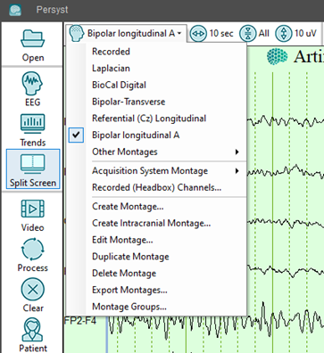

# Selecting a Montage

# **Selecting a Montage**

The **Montage Selection**
button on the EEG Button Bar is used to select
the desired Montage (channel set) to be displayed. To keep the list compact only those Montages designated as “favorites” are displayed. There is a selection on the drop down called “Montage Groups…” that allows the user to select and de-select which Montages will be displayed by user-defined group. Montages can be added, deleted, and modified
—see the help topic 
Edit or Create a New Montage
for details
.

