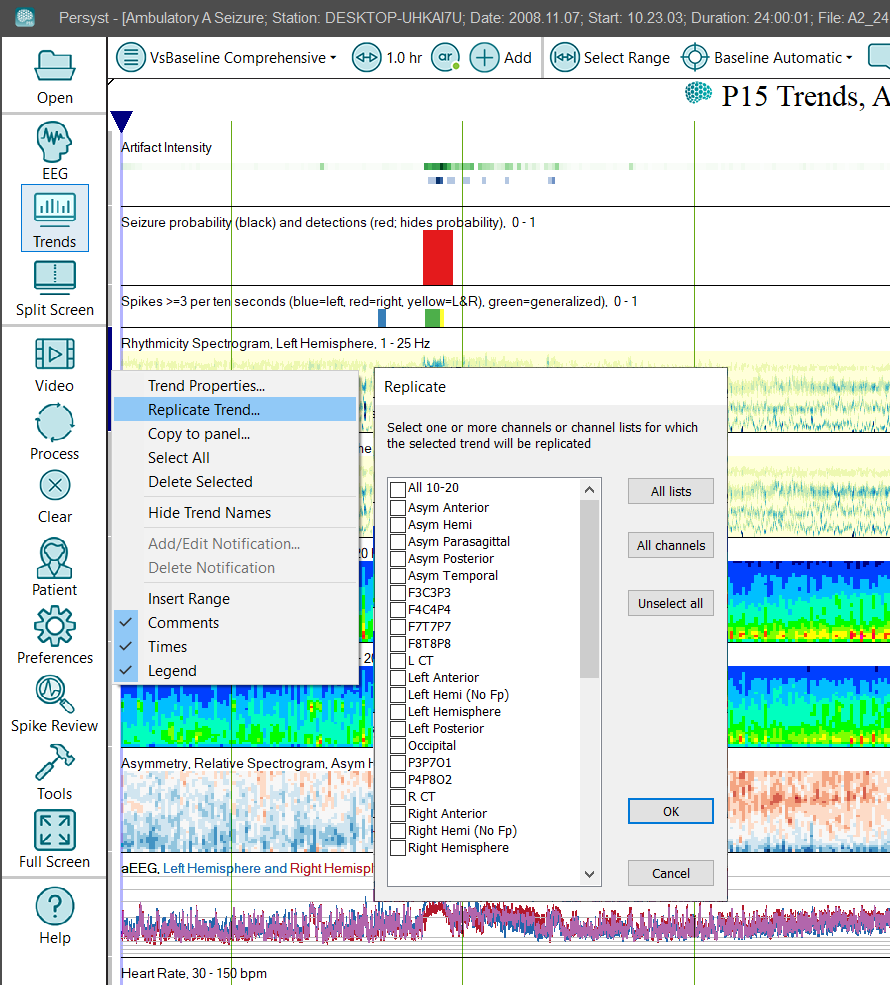

# Change the Trend Display

# **Change the Trend Display**

A Trend Panel can be modified directl
y from the Trend Panel display:

**Trend Duration (X-Axis Range)**

Click on the
Page Duration button
to adjust the
duration
from 15 minutes to 16 hours per page.

**Trend Scaling (Z-Axis Range)**

Click on the Z-Axis Range to change the Z-Axis scaling.
This option
is displayed automatically for 2
D trends. For spectrogram trends this control will adjust the gain (e.g., uV/Hz). If trends that use the same
trend
(e.g., Rhythmicity or FFT Spectrogram Left and Right) have the “Master Control” option set then all of the same trend types will be scaled together

**Trend Scaling (Y-Axis Range)**

Click on the Y-Axis Range to change the
Y
-Axis scaling
. This option is displayed for 2
D
and 1D
trends if scaling is available.
This control will typically adjust the frequency range or amplitude range depending on the type of trend.
If trends that use the same
trend
(e.g., Rhythmicity or FFT Spectrogram Left and Right) have the “Master Control” option set then all of the same trend types will be scaled together

**Channel**

Click on the Channels to select from the available channels or 
Channel List
.

**Position**

The order of trends from top-to-bottom in the Trend Panel display can be reordered. Click and drag to reposition a trend.

**Adding Trends**

Select the “+” button on the System Button Bar to add a trend to the currently displayed Trend Panel.
It is possible to create
new trends through 
Trend Preferences
.

**Replicating** **Trends**

Right-click on the gray control bar at the left end of the trend to be
replicated
and then select **Replicate** **Trend**
. Select the desired channels or channel lists from the **Replicate**
dialog and then select OK. The selected trend will be
replicated
within the displayed trend panel.

**Saving Changes to the Trend Display**

Select **Preferences|Trend Preferences**
then **Save**
or **Save As**
to save your changes.

IMPORTANT: Some OEM EEG systems are configured to automatically propagate changes made to the Trend Preferences to all acquisition and review systems automatically. Refer to your OEM system documentation for specific recommendations on propagating Trend Preferences to other EEG acquisition and review systems on your network.

## **Discarding Changes to the Trend Display**

If
Persyst 15 is closed without saving your changes then the Trend Panel configuration will revert to the last saved configuration.