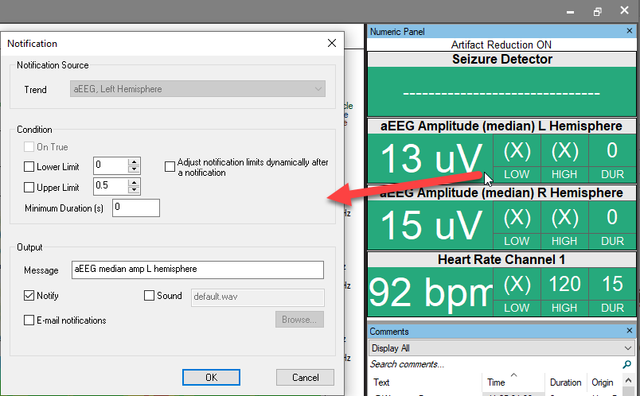
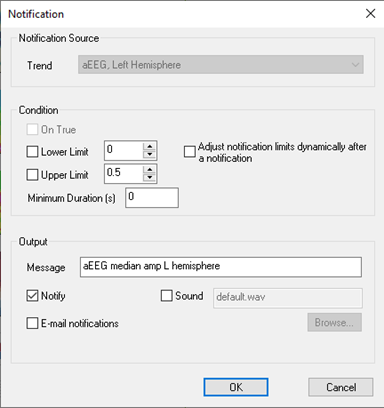
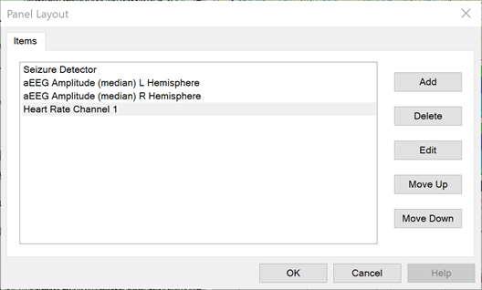

# Numeric Values

# **Numeric** **Values**

The Numeric
Values
tab is automatically populated with the
trends listed on the Notifications
tab (Preferences|Trend Preferences|Notifications).

The Numeric
Values
correspond
with the current position of the cursor during review, or the current
time during on-line processing. The values displayed correspond with the
selection of Artifact Reduction as indicated at the top of the Numeric
Display (as well as the Trend and EEG Windows).

   
*Artifact Reduction OFF*

 *Artifact Reduction ON*

Left-click on the
Numeric Display to set the following parameters:

**Notification
Condition**: Set the high, low, and duration
conditions that will trigger a notification.

**Numeric
Value Format****:**
Set
the display title, decimal places, units, and toggle the option to show
notification thresholds. You can also select Show Text for “condition
on” and “condition off” states.

**Panel
Layout:** Set the vertical arrangement
of the numeric displays.

See the Help Topic
Displays: Numeric, Electrode
Signal Quality, Comment, Video for instructions
on adding seizure detection to the Numeric Display.