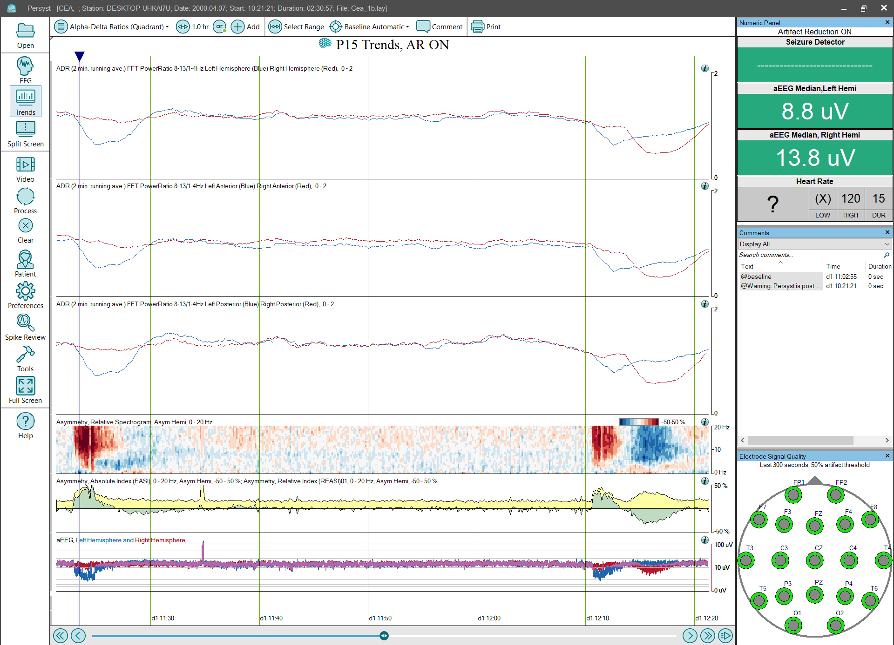

# Trend Panel: Alpha-Delta Ratios

# **Trend Panel: Alpha-Delta Ratios**

**FFT Power Ratio, 8-13 Hz/1-4Hz, 2 Minute Running Average, Left vs. Right:**
These trends show the Alpha-Delta Ratio for the Left Hemisphere EEG in blue superimposed with the Alpha-Delta Ratio for the Right Hemisphere in red.
(Click 
here
for details of the Ratio trend implementation.)

The Alpha-Delta Ratio is calculated using a
n
FFT Power Ratio
trend
.
The
Power
Ratio is
then
a
veraged over a 2-minute period using a
Time trend
.
(Click 
here
for details of the
Time
trend implementation.)

The Channel Lists for the three Left vs. Right Alpha-Delta Ratio trends are: Left vs. Right Hemisphere, Left vs. Right Anterior, and Left vs. Right Posterior.

**Asymmetry, Relative Spectrogram (REASI Spectrogram)**
:
This spectrogram shows the difference between a left-hemisphere spectrogram and a right-hemisphere spectrogram (between homologous electrodes). This provides additional information about an asymmetry noted in the EASI/REASI index trends, e.g., at what frequency is the asymmetry most prominent? The vertical axis is frequency, and increasing asymmetry is indicated in red for right-weighted and blue for left-weighted. The color spectrum has been carefully sele
cted to avoid color-preference,
e.g., red doesn’t appear bri
ghter/more intense than blue.
(Click 
here
for details of the
REASI Spectrogram trend
implementation.)

**EEG Asymmetry Index (EASI):**
This trend is displayed in yellow and is overlaid with the Relative EEG Asymmetry (REASI) trend in green. Deflection is upward (positive) only. The EASI index increases with increasing amplitude differences between homologous electrodes (e.g., C3 vs. C4, F3 vs. F4, etc.) across the 1-18Hz range.
(Click 
here
for details of the
EASI trend
implementation.)

**Relative EEG Asymmetry Index (REASI):**
The relative EEG asymmetry index (REASI) displays left vs. right EEG asymmetry in green. It is overlaid with the absolute EEG asymmetry (EASI) trend in yellow. The green REASI index deflects upward for right-weighted asymmetry or downward for left-weighted asymmetry. Both the EASI and REASI trends display the power difference between homologous electrodes (e.g., C3 vs. C4, F3 vs. F4, etc.) from 1-18Hz in the example configurations.
(Click 
here
for details of the
REASI trend
implementation.)

