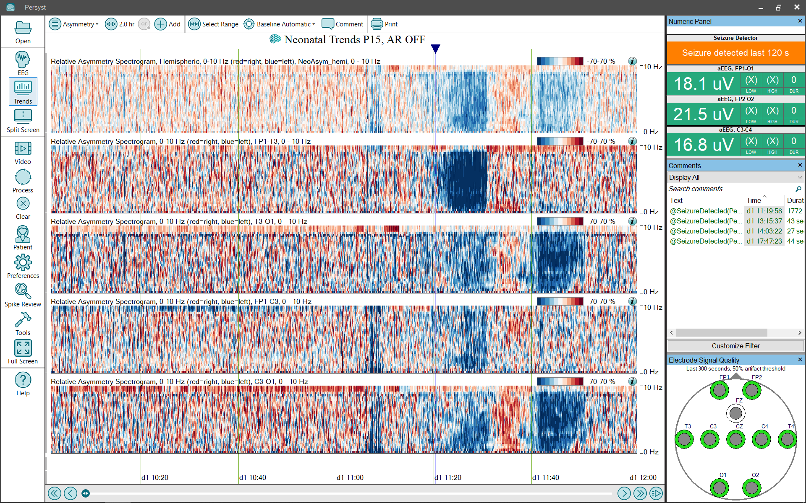

# Trend Panel: Asymmetry Neonatal

# **Trend Panel: Asymmetry (neonatal)**

The neonatal **Asymmetry**
trend panel configuration provides a more extensive set (Panel) of trends for EEG review:

**Asymmetry, Relative Spectrogram (REASI Spectrogram), Left vs. Right and by channel**
:
This spectrogram shows the difference between left (hemisphere or channel) spectrogram and a right-hemisphere spectrogram (hemisphere or channel) between homologous electrodes. This provides additional information about an asymmetry noted in the EASI/REASI index trends, e.g., at what frequency is the asymmetry most prominent? The vertical axis is frequency, and increasing asymmetry is indicated in red for right-weighted and blue for left-weighted. The color spectrum has been carefully sele
cted to avoid color-preference,
e.g., red doesn’t appear bri
ghter/more intense than blue.
(Click 
here
for details of the
REASI Spectrogram trend
implementation.)

