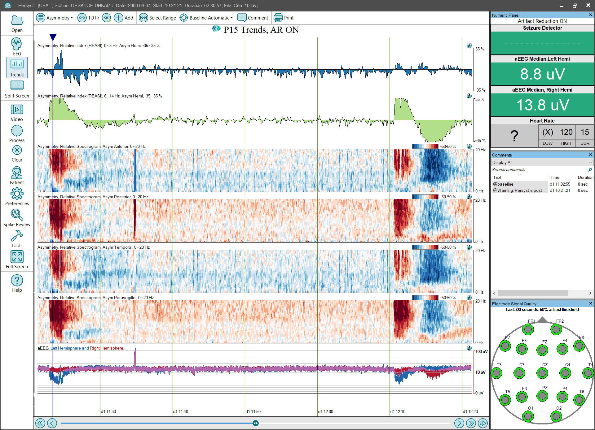

# Trend Panel: Asymmetry

# **Trend Panel: Asymmetry**

**Relative EEG Asymmetry Index (REASI)** **0-5Hz and 6-14Hz Hemisphere:**
The relative EEG asymmetry index (REASI) displays left vs. right EEG asymmetry in green. It is overlaid with the absolute EEG asymmetry (EASI) trend in yellow. The green REASI index deflects upward for right-weighted asymmetry or downward for left-weighted asymmetry. Both the EASI and REASI trends display the power difference between homologous electrodes (e.g., C3 vs. C4, F3 vs. F4, etc.) from 1-18Hz in the example configurations.
(Click 
here
for details of the
REASI trend
implementation.)

**Asymmetry, Relative Spectrogram (REASI Spectrogram)** **Anterior,** **Posterior, Temporal, Parasagittal:**
This spectrogram shows the difference between a left-hemisphere spectrogram and a right-hemisphere spectrogram
by Channel Lists for Anterior, Posterior, Temporal, and Parasagittal
. This provides additional information about an asymmetry noted in the EASI/REASI index trends, e.g., at what frequency is the asymmetry most prominent? The vertical axis is frequency, and increasing asymmetry is indicated in red for right-weighted and blue for left-weighted. The color spectrum has been carefully sele
cted to avoid color-preference,
e.g., red doesn’t appear bri
ghter/more intense than blue.
(Click 
here
for details of the
REASI Spectrogram trend
implementation.)

