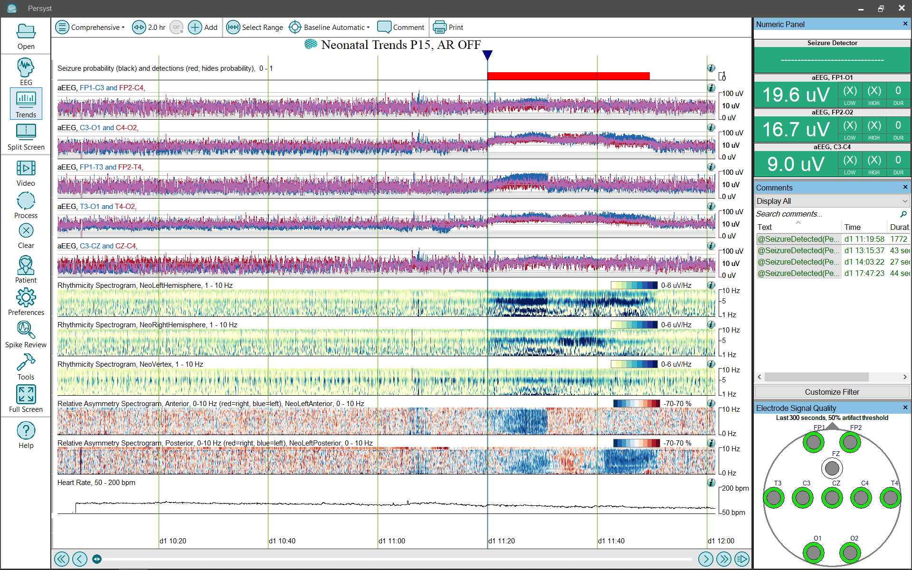
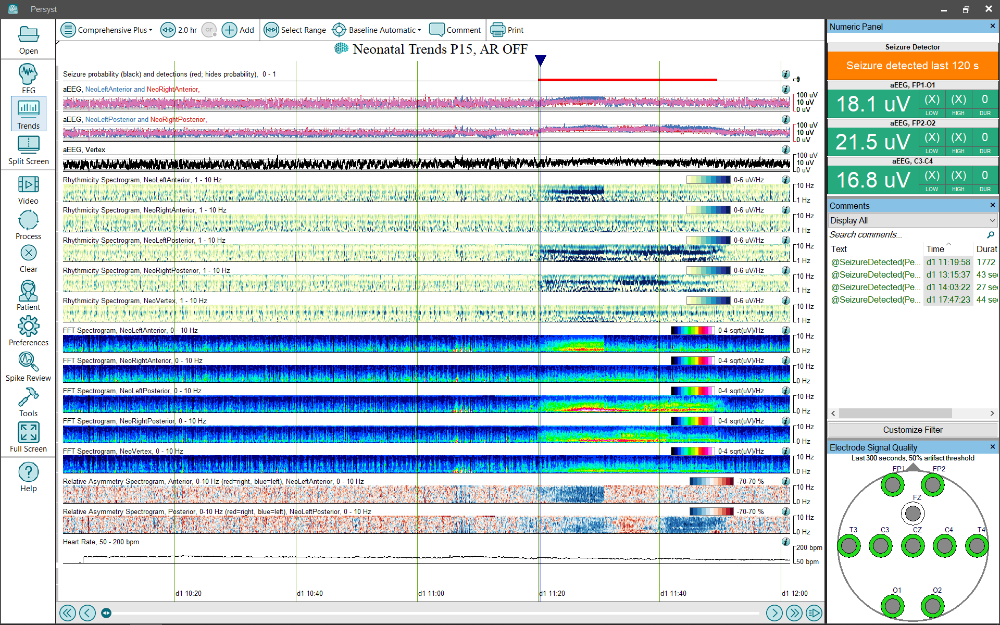

# Trend Panel: Comprehensive Neonatal

# **Trend Panel: Comprehensive and Comprehensive Plus (neonatal)**

The neonatal **Comprehensive**
trend panel configuration provides a more extensive set (Panel) of trends for EEG review:

**Seizure Probability, neonatal (black)****:**
The Seizure Probability trend uses a bar graph to show the Persyst Seizure detector output scaled so that at each one-second interval the height of the bar represents the probability that the interval repre
sents an electrographic seizure. Click 
here
for details of the Persyst Seizure Probability Trend).

**Seizure Detections, neonatal (red, hides probability)****:**
Displays a red block
where the Persyst seizure detection algorithm has detected a seizure. Click 
here
for
information on the performance characteristics of Persyst
Seizure Detection.

**aEEG by Channel**
:
This trend deflects with changes in EEG amplitude. It represents EEG amplitude information and does not depict information concerning frequency or rhythmicity.
(Click 
here
for details of the
aEEG trend
implementation.) The aEEG trend is overlapped to make it easier to visualize amplitude asymmetries. Left is blue, right is red, and overlap is pink in color.

**Rhythmicity Spectrogram, Vertex,****Left and Right Hemisphere:**
Displays the calculated amount of rhythmic/periodic components of the EEG waveform and is not a clinically validated measure. The horizontal (x) axis is time, the vertical (y) axis is frequency (Hz), and the color (z) axis is amplitude.
(
Click 
here
f
or details of the
Rhythmicity Spectrogram trend
implementation.
)

**FFT Spectrogram with Square-Root (SQRT) Scaling, Left and Right Hemisphere:**
Displays the frequency content of the EEG using the SQRT (square root) scaling method. This provides better dynamic range throughout the clinical power spectrum, making it easier to observe changes at both the delta and beta ends of the spectrum and everything in between without the need for frequent alterations of the z-axis color scaling. The horizontal (x) axis is time, the vertical (y) axis is frequency (Hz), and the color (z) axis is amplitude.
(Click 
here
for details of the
FFT Spectrogram trend
implementation.)

**Asymmetry, Relative Spectrogram (REASI Spectrogram), Left vs. Right Anterior and Left vs. Right Posterior**
:
This spectrogram shows the difference between a left-hemisphere spectrogram and a right-hemisphere spectrogram (between homologous electrodes). This provides additional information about an asymmetry noted in the EASI/REASI index trends, e.g., at what frequency is the asymmetry most prominent? The vertical axis is frequency, and increasing asymmetry is indicated in red for right-weighted and blue for left-weighted. The color spectrum has been carefully sele
cted to avoid color-preference,
e.g., red doesn’t appear bri
ghter/more intense than blue.
(Click 
here
for details of the
REASI Spectrogram trend
implementation.)

**Heart Rate, 50-200 BPM:**
The Heart Rate trend measurement is based on the ECG channel in the EEG recording. The ECG analysis is not sufficient by itself to mark an event. The ECG channel is configured according to the ECG channels / labels configured on the EEG acquisition system to enable ECG analysis during on-line or off-line processing of trends and event detection.

The absence of an ECG channel or failure to set up the channel for analysis does not impede or have any effect on the function of the other detectors.

The Heart Rate trend displays the median heart rate calculated from the last 15 beats based on the ECG channels selected by the user in the Trend Template (.mmx file) configured based on the ECG channels used by the facility EEG systems.

(Click 
here
for details of
the Heart Rate trend
implementation.)

  
Comprehensive (neonatal)

  
Comprehensive Plus (neonatal)