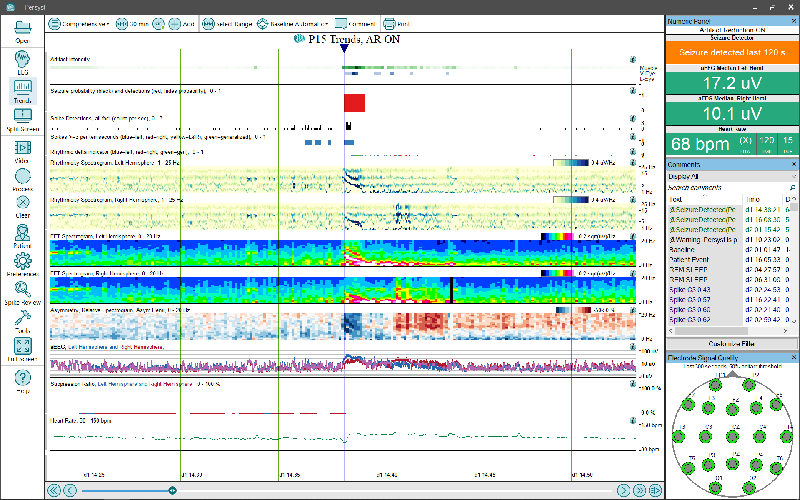

# Trend Panel: Comprehensive

# **Trend Panel: Comprehensive**

The **Comprehensive**
trend panel configuration provides a more extensive set (Panel) of trends for EEG review:

**Artifact Intensity:**
The Artifact Intensity Trend shows the calculated amount of physiological artifact over time. Increasing artifact is indicated by increasingly darker trends for each artifact type. The artifact types are Muscle, V-Eye (vertical eye movement) and L-Eye (lateral eye movement). (
Click 
here
f
or details
of the Artifact Intensity trend
implementation.
)

**Seizure Probability (black)****:**
The Seizure Probability trend uses a bar graph to show the Persyst Seizure detector output scaled so that at each one-second interval the height of the bar represents the probability that the interval repre
sents an electrographic seizure. Click 
here
for details of the Persyst Seizure Probability Trend).

**Seizure Detections (red, hides probability)****:**
Displays a red block
where the Persyst seizure detection algorithm has detected a seizure. Click 
here
for
information on the performance characteristics of Persyst
Seizure Detection.

**Spike Detections, all foci (count per sec):**
A Spike Density trend generates a graphical depiction of information contained in Spike text comments that were generated during Persyst Spike Detector’s algorithmic analysis of an EEG recording. An output value concerning spike detection frequency is plotted as a function of time.
Click 
here
for details of the Persyst Spike Detector.

**Spikes >=3 per ten seconds (blue=left, red=right, yellow=L&R), green=generalized)****:**
A Spike Density trend generates a graphical depiction of information contained in Spike text comments that were generated during Persyst Spike Detector’s algorithmic analysis of an EEG recording. An output value concerning spike detection frequency is plotted as a function of time.
Click 
here
for details of the Persyst Spike Detector.

**Rhythmic delta indicator (blue=left, red=right, green=gen):**
Displays the calculated amount of rhythmic delta components of the EEG waveform
. It uses the output of the Rhythmicity Spectrograms (below)
and is not a clinically validated measure. The horizontal (x) axis is time, the vertical (y) axis is threshold, and the color (z) axis is left, right, or generalized.
(
Click 
here
f
or details of the
Rhythmicity Spectrogram trend
implementation.
)

**Rhythmicity Spectrogram****, Left and Right Hemisphere:**
Displays the calculated amount of rhythmic/periodic components of the EEG waveform and is not a clinically validated measure. The horizontal (x) axis is time, the vertical (y) axis is frequency (Hz), and the color (z) axis is amplitude.
(
Click 
here
f
or details of the
Rhythmicity Spectrogram trend
implementation.
)

**FFT Spectrogram with Square-Root (SQRT) Scaling, Left and Right Hemisphere:**
Displays the frequency content of the EEG using the SQRT (square root) scaling method. This provides better dynamic range throughout the clinical power spectrum, making it easier to observe changes at both the delta and beta ends of the spectrum and everything in between without the need for frequent alterations of the z-axis color scaling. The horizontal (x) axis is time, the vertical (y) axis is frequency (Hz), and the color (z) axis is amplitude.
(Click 
here
for details of the
FFT Spectrogram trend
implementation.)

**Asymmetry, Relative Spectrogram (REASI Spectrogram)**
:
This spectrogram shows the difference between a left-hemisphere spectrogram and a right-hemisphere spectrogram (between homologous electrodes). This provides additional information about an asymmetry noted in the EASI/REASI index trends, e.g., at what frequency is the asymmetry most prominent? The vertical axis is frequency, and increasing asymmetry is indicated in red for right-weighted and blue for left-weighted. The color spectrum has been carefully sele
cted to avoid color-preference,
e.g., red doesn’t appear bri
ghter/more intense than blue.
(Click 
here
for details of the
REASI Spectrogram trend
implementation.)

**aEEG Left + Right**
:
This trend deflects with changes in EEG amplitude. It represents EEG amplitude information and does not depict information concerning frequency or rhythmicity.
(Click 
here
for details of the
aEEG trend
implementation.)

The aEEG trend is overlapped to make it easier to visualize amplitude asymmetries. Left is blue, right is red, and overlap is pink in color.

**Suppression** **(avg 60 sec)****, 0-1****:**
The Suppression Ratio takes the percentage of time that the EEG amplitude is below a user-defined uV threshold) over a 60-second timeframe. The graph is displayed as a
percentage from 0 to 1
.
(Click 
here
for details of the
Suppression Ratio trend
implementation.)

