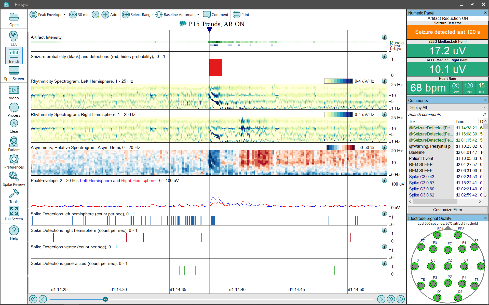

# Trend Panel: Peak Envelope

# **Trend Panel: Peak Envelope**

The **Peak Envelope**
trend panel configuration provides a simplified collection (Panel) of trends for seizure review:

**Artifact Intensity:**
The Artifact Intensity Trend shows the calculated amount of physiological artifact over time. Increasing artifact is indicated by increasingly darker trends for each artifact type.
The artifact types are Muscle
, V-Eye (vertical eye movement) and L-Eye (lateral eye movement). (
Click 
here
f
or details
of the Artifact Intensity trend
implementation.
)

**Seizure Detections (red, hides probability)****:**
Displays a red
block
where the Persyst seizure detection algorithm has detected a seizure.
Click 
here
for
information on the performance characteristics of Persyst
Seizure Detection.

**Seizure Probability (black)****:**
The Seizure Probability trend uses a bar graph to show the Persyst Seizure detector output scaled so that at each one-second interval the height of the bar represents the probability that the interval repre
sents an electrographic seizure. Click 
here
for details of the Persyst Seizure Probability Trend).

**Rhythmicity Spectrogram****, Left and Right Hemisphere:**
Displays the calculated amount of rhythmic/periodic components of the EEG waveform and is not a clinically validated measure
.
The horizontal (x) axis is time, the vertical (y) axis is frequency (Hz), and the color (z) axis is amplitude.
(
Click 
here
f
or details of the
Rhythmicity Spectrogram trend
implementation.
)

**Asymmetry, Relative Spectrogram (REASI Spectrogram)**
:
This spectrogram shows the difference between a left-hemisphere spectrogram and a right-hemisphere spectrogram (between homologous electrodes). This provides additional information about an asymmetry noted in the aEEG trends, e.g., at what frequency is the asymmetry most prominent? The vertical axis is frequency, and increasing asymmetry is indicated in red for right-weighted and blue for left-weighted asymmetries. The color spectrum has been carefully selected to avoid color-preference (e.g., red doesn’t appear brighter/more intense than blue).
(Click 
here
for details of the
REASI Spectrogram trend
implementation.)

**Peak Envelope 2-20 Hz Left + Right**
:
This trend shows the amplitude of EEG within the 2-20 Hz frequency range. Seizure activity often occurs within this frequency range, so it is helpful for seizure review. Right Peak Envelope Power is shown in red, and Left Peak Envelope Power is shown in blue.
Click 
here
For det
ails of the Peak Envelope trend
implementation.

**Spike Detections (count per sec)**
:
This trend shows the output of the Persyst spike detector as the rate of spikes detected per 1 second epoch for Left Hemisphere, Right Hemisphere, Vertex, and Generalized. Note that the primary method for reviewing spike detections is the 
Spike Review
tool.
(Click 
here
for details of the
Spike Detection
trend implementation.)

