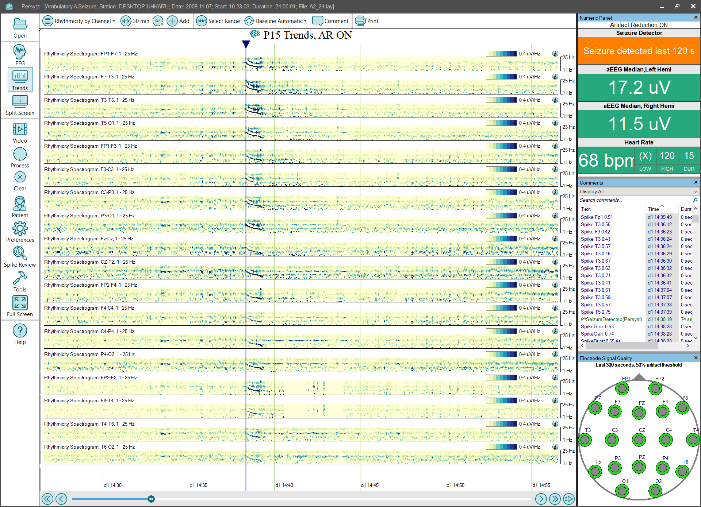

# Trend Panel: Rhythmicity by Channel

# **Trend Panel: Rhythmicity by Channel**

The **Rhythmicity by Channel**
trend panel configuration provides Rhythmicity Spectrograms for individual channels using a typical bipolar longitudinal montage configuration:

**Rhythmicity Spectrogram** **[channel]****:**
Displays the calculated amount of rhythmic/periodic components of the EEG waveform and is not a clinically validated measure
.
The horizontal (x) axis is time, the vertical (y) axis is frequency (Hz), and the color (z) axis is amplitude.
(
Click 
here
f
or details of the
Rhythmicity Spectrogram trend
implementation.
)

