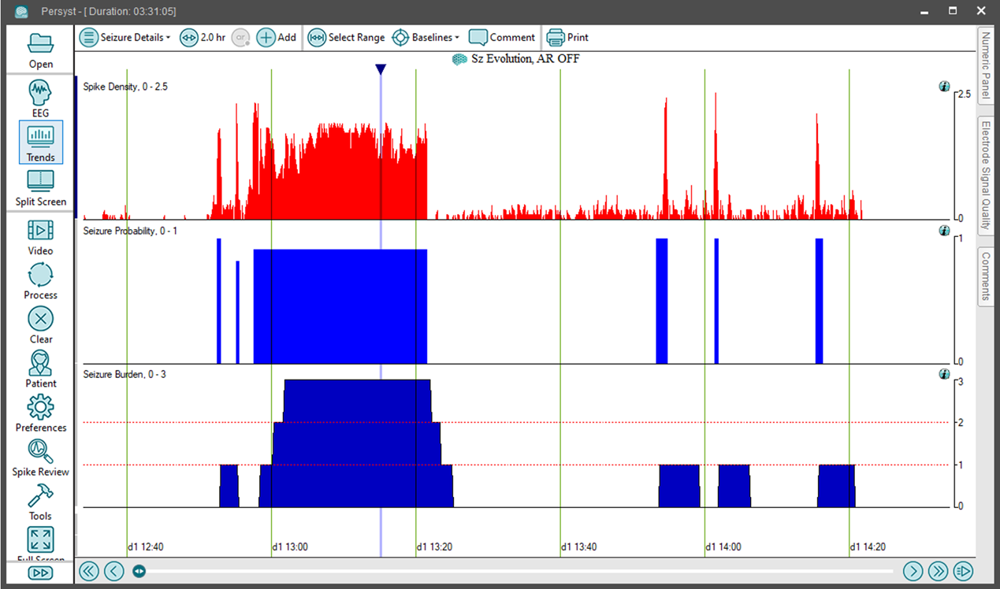

# Trend Panel: Seizure Burden

# **Trend Panel: Seizure Burden**

In conjunction with the reduced set of electrodes, the seizure burden trend will be calculated on the previous five-minute period every ten seconds. The results are calculated and displayed 400 seconds after the end of the relevant period, or at the end of the record, whichever comes first.

The result will be displayed in a value from 0 to 3, where the values have the following meaning:  
0)  No seizures or less than 30 seconds of seizures.  
1) >= 30 and < 150 seconds of seizures. {Frequent}  
2) >= 150 seconds and <= 270 seconds of seizures. {Abundant}  
3) >= 270 seconds of seizures. {Continuous}

