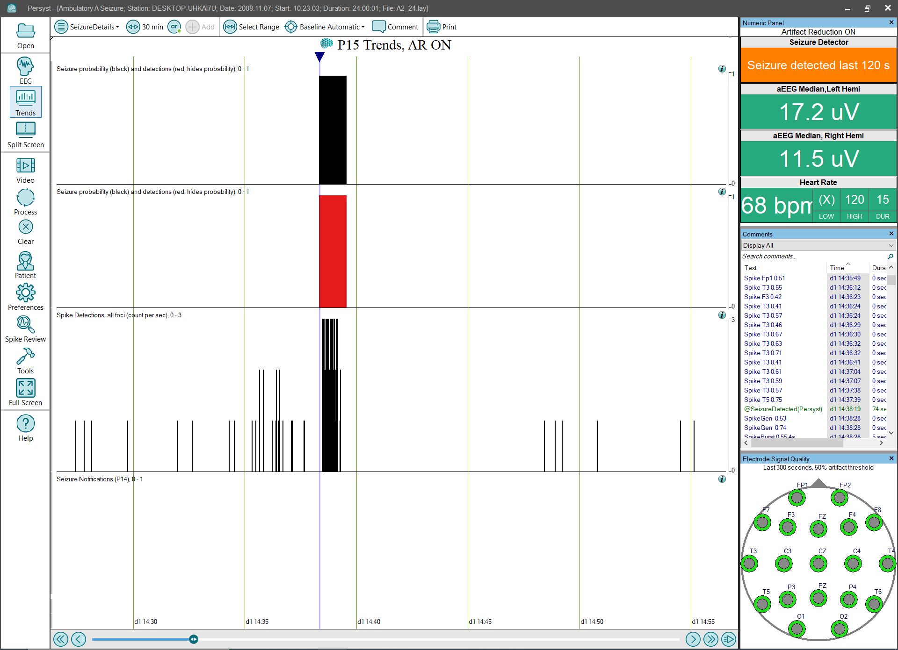

# Trend Panel: Seizure Details

# **Trend Panel: Seizure Details**

The Seizure Details trend panel is the default trend display provided with the Persyst EMU and Persyst Ambulatory packages. It displays only Seizure
Detections
and Spike Detections (count per 5 sec).

**Seizure Detections****:**
Displays a red
block
where the Persyst seizure detection algorithm has detected a seizure.
Click 
here
for
information on the performance characteristics of Persyst
Seizure Detection.

**Seizure Probability****:**
The Seizure Probability trend uses a bar graph to show the Persyst Seizure detector output scaled so that at each one-second interval the height of the bar represents the probability that the interval repre
sents an electrographic seizure. Click 
here
for details of the Persyst Seizure Probability Trend).

**Spi****ke Detections (count per** **sec)**
:
This trend shows the output of the Persyst spike detector as the rate of spikes detected per 5 second epoch. Note that the primary method for reviewing spike detections is the 
Spike Review
tool.
(Click 
here
for details of the
Spike Detection
trend implementation.)

