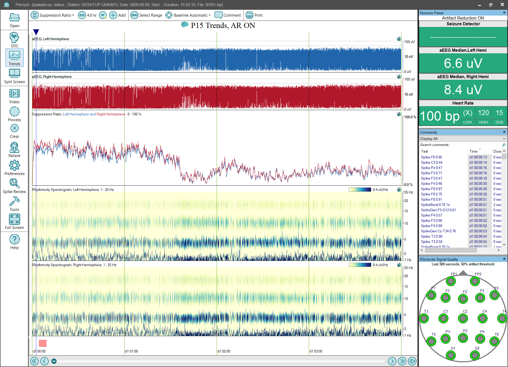

# Trend Panel: Suppression Ratio

# **Trend Panel: Suppression Ratio**

The **Suppression** **Ratio**
trend panel configuration provides a simplified collection (Panel) of trends for monitoring changes in suppression:

**aEEG Left Hemisphere and aEEG Right Hemisphere**
:
This trend deflects with changes in EEG amplitude. It represents EEG amplitude information and does not depict information concerning frequency or rhythmicity
.
(Click 
here
For details of the aEEG trend implementation.)

The aEEG Left Hemisphere is rendered in blue, and the aEEG Right Hemisphere is rendered in red.

The scaling is semi-logarithmic, e.g., the bottom-half of the scale is 0-10 uV, and the upper-half of the scale is 10-100 uV.

**Suppression Ratio:**
The Suppression
Ratio
takes the percentage of time that the EEG amplitude is below a user-defined uV threshold) over a 60-second timeframe. The graph is displayed as a percentage.
Click 
here
For details of the Suppression Ratio trend
trend
implementation.

**Rhythmicity Spectrogram****, Left and Right Hemisphere:**
Displays the calculated amount of rhythmic/periodic components of the EEG waveform and is not a clinically validated measure
.
The horizontal (x) axis is time, the vertical (y) axis is frequency (Hz), and the color (z) axis is amplitude.
(
Click 
here
f
or details of the
Rhythmicity Spectrogram trend
implementation.
)

