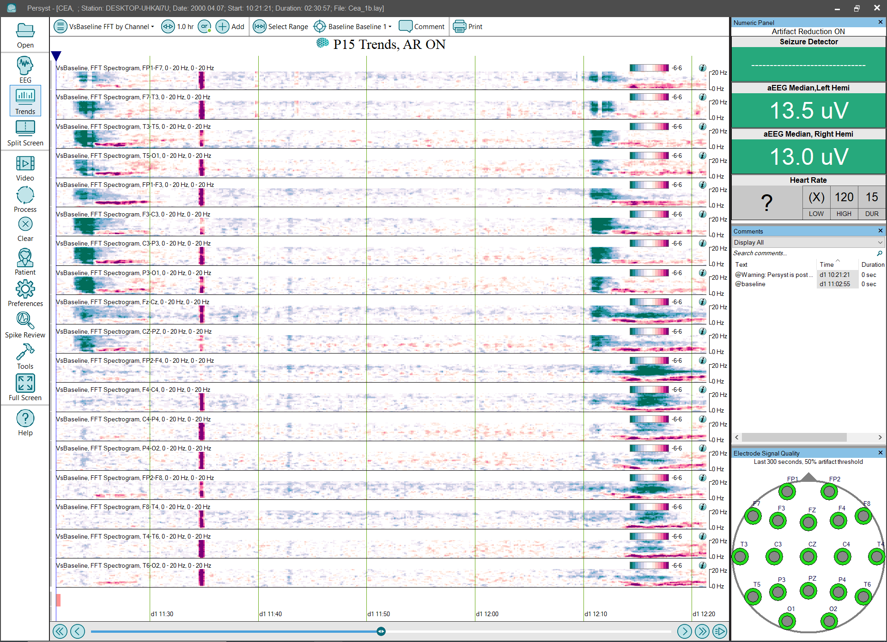

# Trend Panel: VsBaseline FFT by Channel

# **Trend Panel: VsBaseline FFT by Channel**

**VsBaseline Spectrogram, 0-20Hz, by channel:**
Displays the normalized z-score versus the empirical null calculated from the baseline selected on the Trend Button Bar. The horizontal (x) axis is time, the vertical (y) axis is frequency (Hz), and the color (z) axis are z-scores vs. the selected baseline. The two-ended color scale is increasingly red for positive z-scores and increasingly green for negative z-scores.
(Click 
here
for details of the
VsBaseline Spectrogram trend
implementation.)

