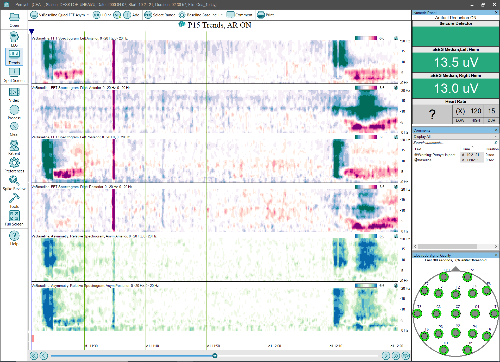

# Trend Panel: VsBaseline Quad FFT Asym

# **Trend Panel: VsBaseline Quad FFT Asym**

**VsBaseline Spectrogram, 0-20Hz, Left and Right Anterior, Left and Right Posterior:**
Displays the normalized z-score versus the empirical null calculated from the baseline selected on the Trend Button Bar. The horizontal (x) axis is time, the vertical (y) axis is frequency (Hz), and the color (z) axis are z-scores vs. the selected baseline. The
two-ended
color scale is increasingly red for positive z-scores and increasingly green for negative z-scores.
(Click 
here
for details of the
VsBaseline Spectrogram trend
implementation.)

**VsBaseline Asymmetry, Relative Spectrogram, 0-20Hz, Left and Right Hemisphere:**
Displays the normalized z-score versus the empirical null calculated from the baseline selected on the Trend Button Bar. The horizontal (x) axis is time, the vertical (y) axis is frequency (Hz), and the color (z) axis are z-scores vs. the selected baseline
for Asymmetry. The two
-ended color scale is the same color
(green)
at either maximum because Asymmetry z-scores represent the absolute differences from baseline.
(Click 
here
for details of the
VsBaseline Spectrogram trend
implementation.)

