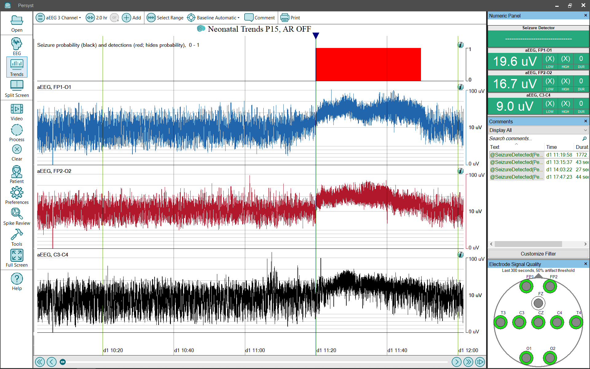
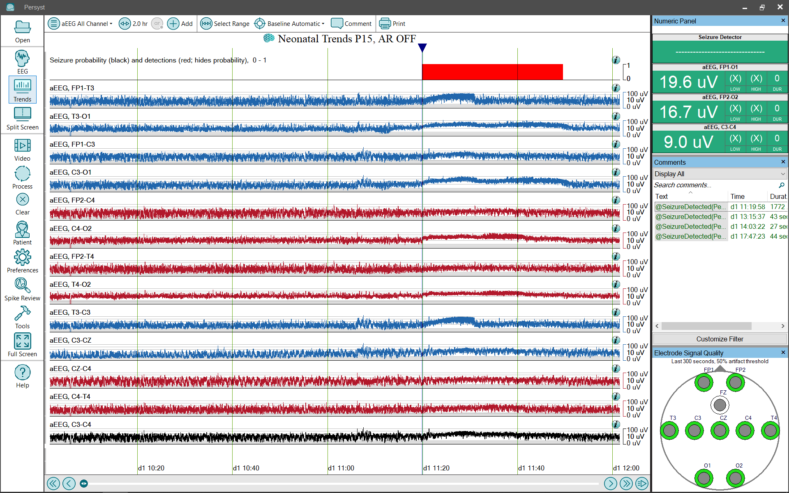

# Trend Panel: aEEG Neonatal

# **Trend Panel:** **aEEG 3 Channel and aEEG All Channel**

The **aEEG 3 Channel and aEEG All Channel**
trend panel configuration provides a simplified collection of trends (Panel) for cEEG monitoring and review:

**Seizure Probability, neonatal (black)****:**
The Seizure Probability trend uses a bar graph to show the Persyst Seizure detector output scaled so that at each one-second interval the height of the bar represents the probability that the interval repre
sents an electrographic seizure. Click 
here
for details of the Persyst Seizure Probability Trend).

**Seizure Detections, neonatal (red, hides probability)****:**
Displays a red block
where the Persyst seizure detection algorithm has detected a seizure. Click 
here
for
information on the performance characteristics of Persyst
Seizure Detection.

**aEEG by Channel**
:
This trend deflects with changes in EEG amplitude. It represents EEG amplitude information and does not depict information concerning frequency or rhythmicity.
(Click 
here
for details of the
aEEG trend
implementation.) The aEEG trend is overlapped to make it easier to visualize amplitude asymmetries. Left is blue, right is red, and overlap is pink in color.

### 

