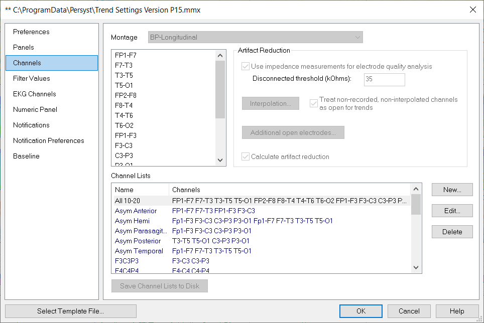
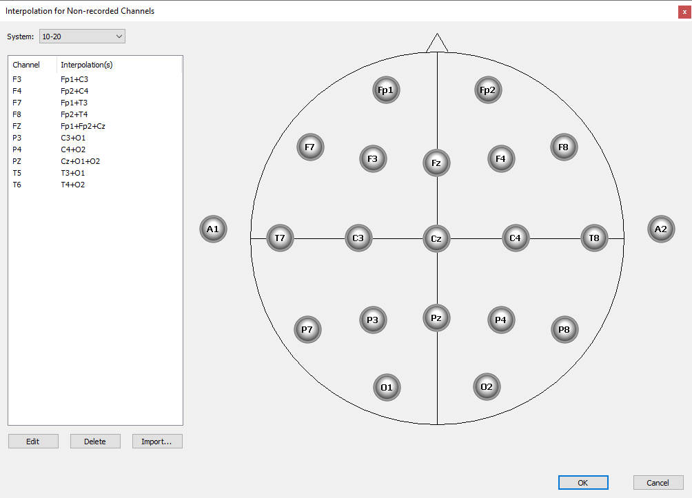
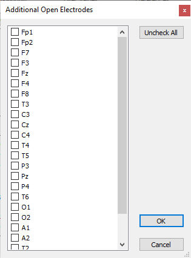

# Trend Preferences: Channels

## **Channel Lists**

A Channel List is a set of one or more channels that can be used as a data source for the trends. The calculations are averaged over the channels selected, or you can display the maximum, minimum or standard deviation of the channel values. The method of combining the channels is chosen in the trend definition.

Select **New** from the **Channels** page to define a new Channel List. Clear existing trends before creating new Channel Lists. Select **Save Changes to Dis****k** to save new or edited Channel Lists.

**Use impedance measurements for electrode quality analysis:** This option will use the initial impedance measurement to mark channels as “open” if their initial impedance measurement exceeds the threshold. Default = selected. Default threshold is 35 KOhms.

**Interpolation:** Treat non-recorded, non-interpolated channels as open for trends. This option will prevent Channel Lists from being invalid when they include channels that are not included in the recording. Instead, missing channels will be marked as "open" and not missing so that trending will proceed with the remaining channels.

Interpolation Dialog: Interpolated electrodes are used for trending and seizure detection when channels in the Trending Montage are not recorded. This is not the same as an open input (which is still recorded). Rather, this is when a channel does not exist in the recording that is part of the Trending Montage. Interpolated electrodes are calculated as an average of the electrodes as defined in the Interpolation Dialog.

Additional Open Electrodes Dialog: Channels selected here will be marked as open. This is for recording configurations where unused channels are still recorded, but not connected to the patient. It is a way to manually designate channels as "open" without relying on the Disconnect threshold, which relies on an initial impedance measurement by default. Use this for configurations where a channel input will not be used study-to-study, and for systems that Persyst does not read initial impedance measurements, and therefore, unused inputs must be designated manually.

**Handling of Open, Missing Interpolated, and Excluded (Additional Open) channels:**

|  |  |  |  |
| --- | --- | --- | --- |
|  | **Missing as open** | **Missing interpolated** | **Excluded   (additional open)** |
| EEG display | Not displayed | Not displayed | Flat lined |
| AR | Not displayed | Not displayed | Skipped, not used |
| Trends | Marked as bad | Use interpolated | Marked as bad |
| Spike detector | Not used | Not used | Flat line if grid1/2  Skip in average electrodes |
| Seizure detector | Marked as bad | Use interpolated | Marked as bad |

# 

# 

