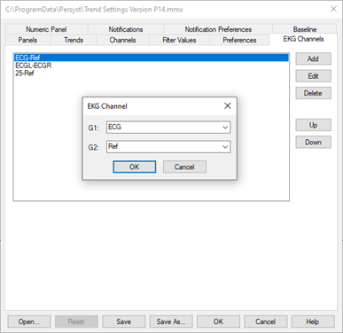
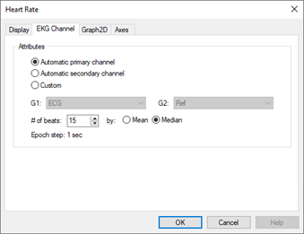

# Trend Preferences: EKG Channels

# Trend Preferences: EKG Channels

The **EKG Channels** tab
is where EKG Channel designations are entered. Select **Preferences|Modify
Template** and then select the Trend Template MMX to designate your
EKG channel labels. Some facilities will have more than one convention
in use (e.g., EKG, ECGL, ECGR, etc. or numbered input). This dialog allows
the user to add the EKG channel labels that will be used in EEG recordings
across different amplifier types and department locations.

The EKG channel
in the top position will be used first for the Heart Rate trend. If that
channel is not present, then the EKG channel in the second position will
be used, and so on.

**Add:**
Add a new EKG channel label for G1 (input 1) and G1 (input 2). The channel
can be selected from the currently open EEG recording or it can be typed
in.  
**Edit:** Edit the EKG channel label.  
**Delete:** Delete the EKG channel label  
**Up/Down:** Move the selected EKG channel up/down in the list for automatic
selection.

Close
the Trend Properties dialog and then select the Heart Rate trend in the
Trend Panel display. Select Automatic primary channel (use the uppermost
EKG channel in the list), Automatic secondary channel (use the second
EKG channel in the list), or Custom to specify the EKG channel G1 and
G2 inputs.

