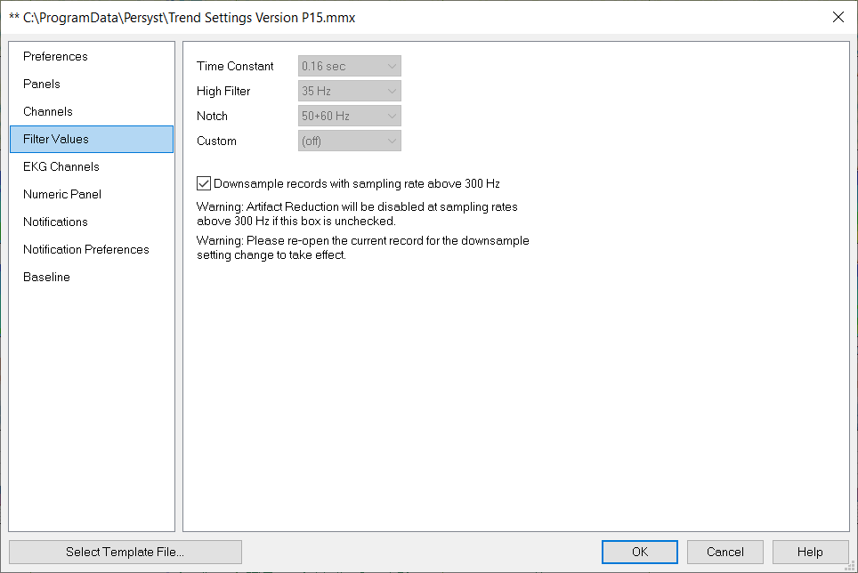

# Trend Preferences: Filter Values

## **Filter Values**

Use the **Filter** **Values** tab to set the **High**, **Low** and **Notch Filters** for the trends (i.e., FFT analysis, etc.). Note that these filter settings may be different than those used by the EEG Page.

**Downsample recordings with sampling rate above 300 Hz:** This option is selected by default for the calculation and display of EEG waveforms and trends with Artifact Reduction. Deselect this option to perform analysis on high-sample rate recordings with activity of interest above 150 Hz.

