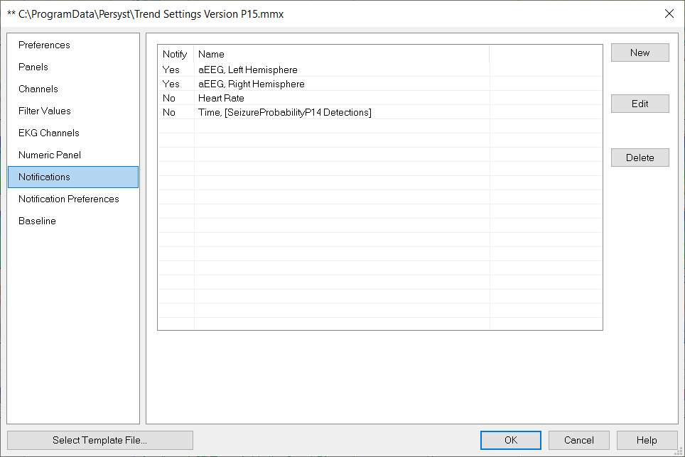
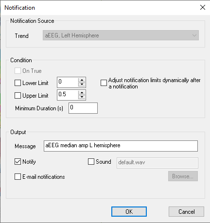
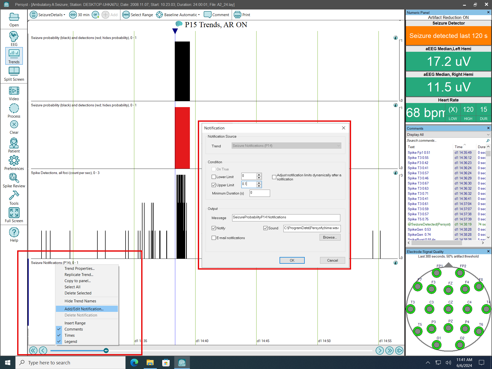
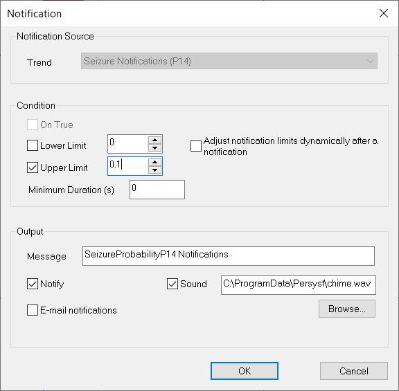

# Trend Preferences: Notifications

# **Trend Preferences: Notifications**

Visual, Persyst Mobile Notifications (requires Persyst Mobile Service, recommended versus. e-mail) and e-mail notifications (requires access to POP3/SMTP mail server) can be set to identify events of interest. A Notification is triggered when a condition trend becomes True.

Select **Preferences|Trend Preferences**
. Select the **Notifications**
tab.

The **Notifications** page allows you to control the types of notifications you want: Visual or E-mail.

**Edit:**
Edit Notification options for the selected trend.

**Delete:**
Delete the trend from the Notifications list.

**New:**
Add a new Notification Source

 **Trend:**
Select the trend

 **Condition:**

**Lower Limit:**
Select the check box to enable, enter a value to set a lower limit or the most negative value.

**Upper Limit:**
Select the check box to enable, enter a value to set a upper limit or the most positive value.

**Minimum Duration:** The number of seconds that the Lower or Upper Limit must be exceed before generating a Visual or Email Notification.

Adjust notifications limits dynamically after a notification : With this option selected, upper and lower limits are automatically adjusted using selected ratchet value. The dynamic (ratcheting) notification will not automatically adjust below the initial Lower Limit value. When the limit changes, the dotted line in the trends view and the values in the notification panel change as well. The original (not adjusted) values are still shown in the notification properties. When notification thresholds are ratcheted up or down, a comment about the limit change is added to the comment list.

**Sound:** If this check box is present then this trend has Audible Notifications available. Select to enable. Browse to select the wave (\*.wav) sound file that should play when a notification threshold is exceeded.

**Trend Preferences: Audible Notifications**

Audible notifications are available for use with the Persyst 14 **Seizure Probability** trend. A Notification is triggered when the seizure detection threshold is exceeded. The **Sound** option for the Seizure Detection notification for the current recording segment can be toggled by selecting the Seizure Details trend panel, and then, right-clicking on the Seizure Notifications trend title and then selecting **Add/Edit Notification**.

Audible seizure detection notifications are enabled by default in the Trend Definition file “Trend Settings Version P15 Audible.mmx”. If you wish to save changes to the **Sound**
options, select **Preferences|Trend Preferences|Modify Template and then select the appropriate MMX file for editing (please**
refer to the section **Saving Changes to the Trend Display)**
.